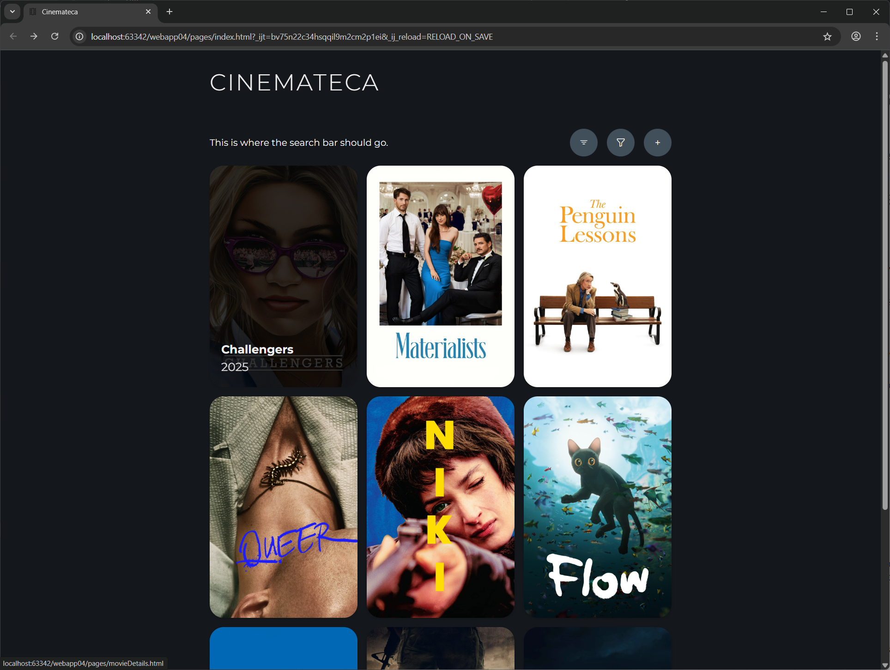
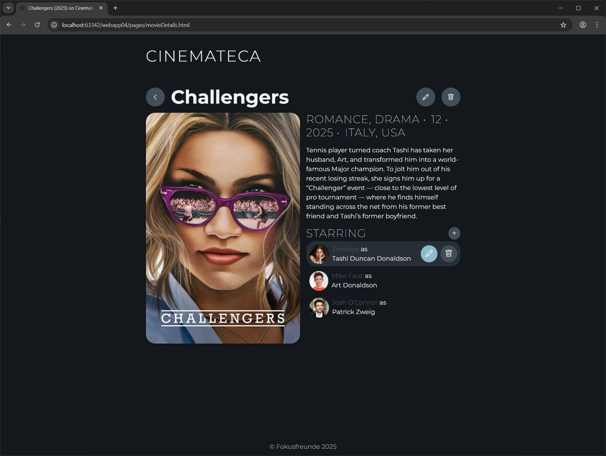
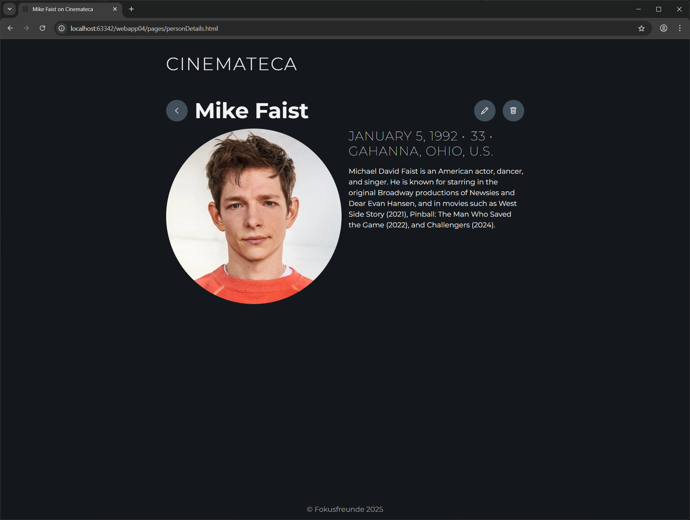

<!-- TOC -->
* [Cinemateca](#cinemateca)
  * [Members of the Group](#members-of-the-group)
  * [Links](#links)
  * [Functionality](#functionality)
    * [Entites](#entites)
      * [Movies](#movies)
      * [Person](#person)
    * [Search](#search)
    * [Filtering](#filtering)
  * [Wireframes](#wireframes)
    * [Wide Screen Views](#wide-screen-views)
    * [Mobile Views](#mobile-views)
* [Práctica 1](#práctica-1)
  * [Screenshots](#screenshots)
  * [Participation](#participation)
    * [Alejandro](#alejandro)
    * [Farina](#farina)
    * [Felix](#felix)
* [Práctica 2](#práctica-2)
  * [Screenshots](#screenshots-1)
  * [Participation](#participation-1)
    * [Alejandro](#alejandro-1)
    * [Farina](#farina-1)
    * [Felix](#felix-1)
* [Práctica 3](#práctica-3)
  * [Screenshots](#screenshots-2)
  * [Participation](#participation-2)
    * [Alejandro](#alejandro-2)
    * [Farina](#farina-2)
    * [Felix](#felix-2)
<!-- TOC -->

# Cinemateca
Cinemateca is a web application that serves as a comprehensive movie catalog, allowing users to browse and search a vast database of films.

## Members of the Group
* Alejandro Guzmán Sánchez (E-Mail: a.guzmans.2025@urjc.es, GitHub: [AlejandroGS47](https://github.com/AlejandroGS47))
* Farina Schlegel (E-Mail: f.schlegel.2025@alumnos.urjc.es, GitHub: [frinnana](https://github.com/frinnana))
* Felix Schwabe (E-Mail: f.schwabe.2025@alumnos.urjc.es, GitHub: [7dns](https://github.com/7dns))

## Links
[Link to Trello](https://trello.com/invite/b/68d0f24f8deb98189ef954eb/ATTI17034f224bc8ee2a098984e95cb7a264E5C95465/cinemateca)

## Functionality
### Entites

#### Movies
`Movie` is the primary entity of the web application. Each `Movie` contains essential information and is linked to its actors. Each `Movie` has at least one actor.

A `Movie` has:
* unique ID,
* title,
* poster (image file),
* short description,
* genre,
* release year,
* country of production,
* age rating,
* one or more actors

#### Person
The secondary entity in the application is `Person`. A `Person` is someone who acts in a `Movie`. *(Optional: A `Person` may also represent any individual involved in at least one `Movie`, such as an actor, director or writer. Every `Person` must be linked to at least one movie.)*

A `Person` has:
* unique ID,
* name
* portrait (image file),
* date of birth,
* place of birth,
* short description

### Search
The application will include a search function that allows users to find movies by their title. *(Optional: Users may also enter the name of a person (e.g. actor, director or writer) involved in the movie.)*

### Filtering
The application will include a function to filter search results (e.g. by genre, release year or country of production).

## Wireframes
The following wireframes show the planned layout of Cinemateca, giving a visual overview of the application’s structure and functionality.

### Wide Screen Views

### Mobile Views

# Práctica 1

## Screenshots

## Participation

### Alejandro
**Description of the Tasks Completed:**
...

**Five Most Significant Commits**
- ...
- ...

**Five Most Contributed Files**
- ...
- ...

### Farina
**Description of the Tasks Completed:**
...

**Five Most Significant Commits**
- ...
- ...

**Five Most Contributed Files**
- ...
- ...

### Felix
**Description of the Tasks Completed:**
Before Alejandro joined the group, Farina and I developed the initial idea for our project and created the wireframes along with the UML class diagram.
I implemented the first version of all four HTML pages and their corresponding CSS files. Early on, I continuously refined the CSS to eliminate redundancies and ensure a consistent design across all pages. To achieve this, I created separate CSS files to store shared variables and common styles. I also made sure that the header and footer were consistent on every page.
When Bootstrap was introduced in class, I refactored some of the existing CSS grids to use Bootstrap’s grid system instead.
I added hover effects to the buttons for the secondary entities (the actors) in `movieDetails.html` to allow editing and deleting them.
Finally, I verified that all pages were fully responsive and made some last adjustments.

**Five Most Significant Commits**
- [d3f02d5](https://github.com/CodeURJC-FW-2025-26/webapp04/commit/d3f02d5a08640904ea29045cf7774de73a87f1dc): Documented the initial project ideas in the README file (together with Farina).
- [324bd1a](https://github.com/CodeURJC-FW-2025-26/webapp04/commit/324bd1ab063eac974a9d8dfe2eb4b577bbc490b7): Realized the first wireframes as HTML pages (`index.html`, `movieDetails.html`, and `personDetails.html`) with CSS. 
- [4b83b8a](https://github.com/CodeURJC-FW-2025-26/webapp04/commit/4b83b8ad5ee8b023b5ce10b58884bf99b2cd9275): Built an initial prototype of the “Add New Primary Entity” feature (`addNewMovie.html`) with CSS. 
- [e4f6304](https://github.com/CodeURJC-FW-2025-26/webapp04/commit/e4f6304aaaeb0ac3b578ed944d5c7bad36b21625): Refactored the CSS structure to include common styles in a shared CSS file and defined reusable values in a separate file for future reuse. 
- [9a4f26f](https://github.com/CodeURJC-FW-2025-26/webapp04/commit/9a4f26f1b65f8a8b885e1db86843ddfd50a25a27): Improved the responsiveness of `movieDetails.html`, particularly the hover effect in the actors list, and `personDetails.html`.

**Five Most Contributed Files**
- [`movieDetails.html`](https://github.com/CodeURJC-FW-2025-26/webapp04/blob/main/pages/movieDetails.html)
- [`personDetails.html`](https://github.com/CodeURJC-FW-2025-26/webapp04/blob/main/pages/personDetails.html)
- [`variables.css`](https://github.com/CodeURJC-FW-2025-26/webapp04/blob/main/styles/variables.css)
- [`pageLayout.html`](https://github.com/CodeURJC-FW-2025-26/webapp04/blob/main/styles/pageLayout.css)
- all images files used for [movie posters](https://github.com/CodeURJC-FW-2025-26/webapp04/tree/main/images/moviePosters) and [actor portraits](https://github.com/CodeURJC-FW-2025-26/webapp04/tree/main/images/persons)

# Práctica 2

## Screenshots

## Participation

### Alejandro
**Description of the Tasks Completed:**
...

**Five Most Significant Commits**
- ...
- ...

**Five Most Contributed Files**
- ...
- ...

### Farina
**Description of the Tasks Completed:**
...

**Five Most Significant Commits**
- ...
- ...

**Five Most Contributed Files**
- ...
- ...

### Felix
**Description of the Tasks Completed:**
...

**Five Most Significant Commits**
- ...
- ...

**Five Most Contributed Files**
- ...
- ...

# Práctica 3

## Screenshots

## Participation

### Alejandro
**Description of the Tasks Completed:**
...

**Five Most Significant Commits**
- ...
- ...

**Five Most Contributed Files**
- ...
- ...

### Farina
**Description of the Tasks Completed:**
...

**Five Most Significant Commits**
- ...
- ...

**Five Most Contributed Files**
- ...
- ...

### Felix
**Description of the Tasks Completed:**
...

**Five Most Significant Commits**
- ...
- ...

**Five Most Contributed Files**
- ...
- ...