# Cinemateca
Cinemateca is a web application that serves as a comprehensive movie catalog, allowing users to browse and search a vast database of films.

**Table of contents**
<!-- TOC -->
* [▶️ How to Install and Run Cinemateca](#how-to-install-and-run-cinemateca)
    * [System Requirements](#system-requirements)
* [Members of the Group](#members-of-the-group)
* [Links](#links)
* [Functionality](#functionality)
* [Wireframes](#wireframes)
* [Práctica 1](#práctica-1)
    * [Screenshots](#screenshots)
    * [Participation](#participation)
* [Práctica 2](#práctica-2)
    * [How to Install and Run](#how-to-install-and-run)
    * [Description of the Created Files](#description-of-the-created-files)
    * [Screenshots](#screenshots-1)
    * [Participation](#participation-1)
* [Práctica 3](#práctica-3)
    * [How to Install and Run](#how-to-install-and-run-1)
    * [Description of the Created Files](#description-of-the-created-files-1)
    * [Screenshots](#screenshots-2)
    * [Participation](#participation-2)
<!-- /TOC -->

## How to Install and Run Cinemateca

Clone the repository:
```bash
git clone https://github.com/CodeURJC-FW-2025-26/webapp04.git
cd webapp04
```

Install dependencies:
```bash
npm install
```

**Note:** Ensure MongoDB is running on `localhost:27017` before starting the application.

Start the application:
```bash
npm start
```

Navigate to [`http://localhost:3000/`](http://localhost:3000/) in your browser to view the application.

### System Requirements

- **Node.js**: version 22.15.1 or higher
- **MongoDB**: version 8.2.1 or higher
    - MongoDB should be running on `localhost:27017` (default)
- **npm Dependencies**
    - `express` (5.1.0 or higher) - Web framework
    - `mongodb` (7.0.0 or higher) - MongoDB driver
    - `mustache-express` (1.3.2 or higher) - Mustache templating engine
    - `multer` (2.0.2 or higher) - File upload handling

## Members of the Group
* Alejandro Guzmán Sánchez (E-Mail: a.guzmans.2025@urjc.es, GitHub: [AlejandroGS47](https://github.com/AlejandroGS47))
* Farina Schlegel (E-Mail: f.schlegel.2025@alumnos.urjc.es, GitHub: [frinnana](https://github.com/frinnana))
* Felix Schwabe (E-Mail: f.schwabe.2025@alumnos.urjc.es, GitHub: [7dns](https://github.com/7dns))

## Links
- [Link to Trello](https://trello.com/invite/b/68d0f24f8deb98189ef954eb/ATTI17034f224bc8ee2a098984e95cb7a264E5C95465/cinemateca)
- [Link to the Screen Recording after Práctica 2](https://www.youtube.com/watch?v=Tq_RHJaIpYg)
- [Link to the Screen Recording after Práctica 3](https://www.youtube.com/watch?v=aSp8bXJcYKA)

## Functionality
### Entities
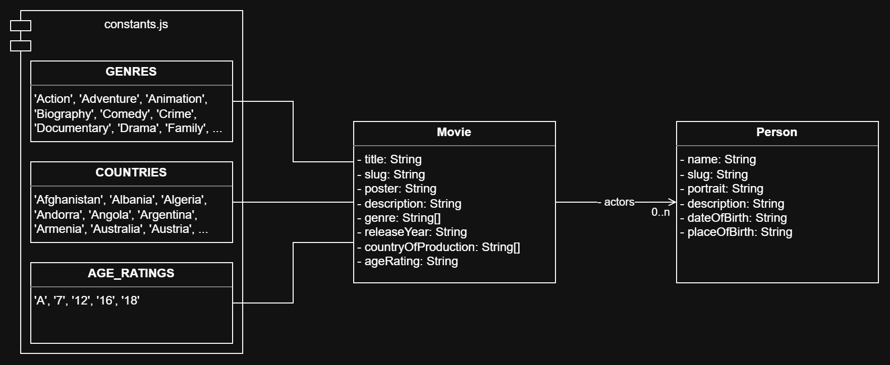

#### Movies
`Movie` is the primary entity of the web application. Each `Movie` contains essential information and is linked to its `Actor`s. `Movies` may have `0` or `n` `Actor`s.

A `Movie` has:
* title,
* unique ID (slug),
* poster (image file),
* description,
* genre,
* release date,
* country of production,
* age rating,
* `0` or `n` `Actor`s

#### Actor
The secondary entity in the application is `Actor`. An `Actor` is someone who acts in a `Movie`. Every `Actor` must be linked to at least one `Movie`.

An `Actor` has:
* name,
* unique ID (slug),
* portrait (image file),
* date of birth,
* place of birth,
* description

### Search
Users can search for movies by title using the real-time search function on the home page.

### Filtering and Sorting
Movies can be filtered by:
- **Genre** - Multiple genres can be selected simultaneously
- **Country of Production** - Multiple countries can be selected simultaneously
- **Age Rating** - Filter by specific age restrictions (A, 7, 12, 16, 18)

Results can be sorted by:
- **Title** - Alphabetically (A-Z or Z-A)
- **Release Year** - Chronologically (oldest first or newest first)

## Wireframes
The following wireframes show the planned layout of Cinemateca, giving a visual overview of the application’s structure and functionality.

### Wide Screen Views
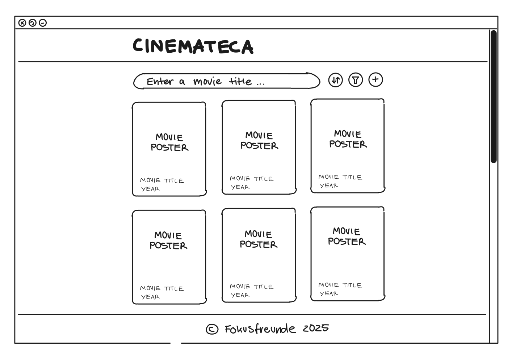
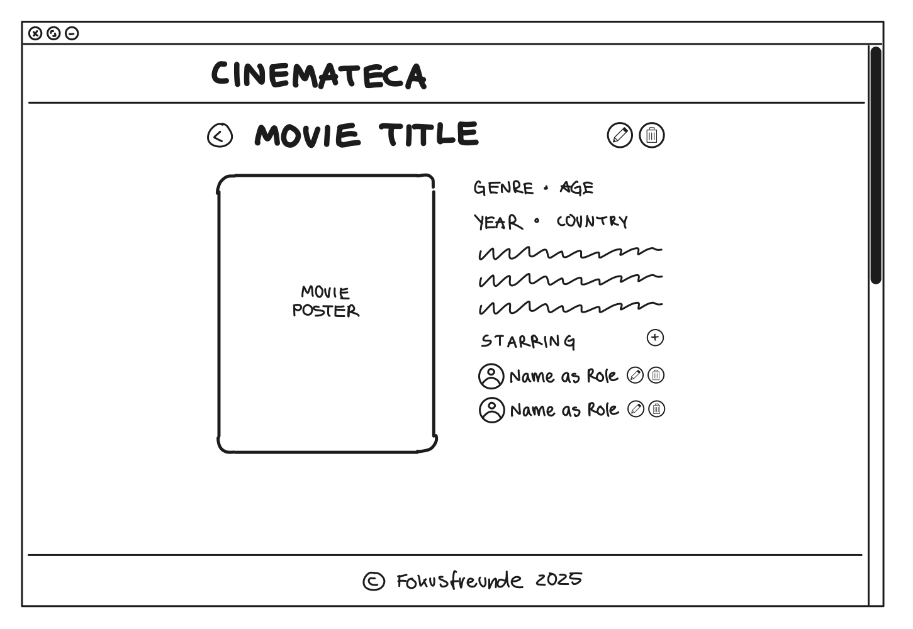


### Mobile Views
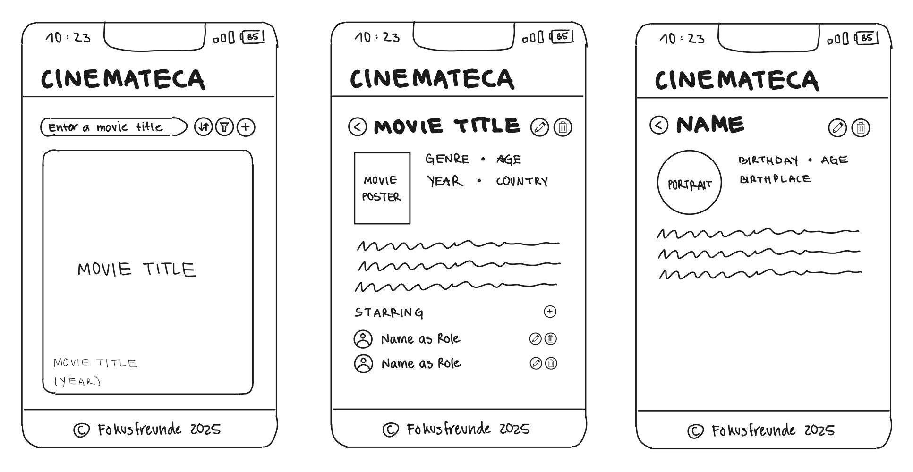

# Práctica 1

## Screenshots


## Participation

### Alejandro
**Description of the Tasks Completed:**
By the time I joined the team, the initial idea of the project had already been developed by Farina and Felix, so a lot of progress had already been done, specially the main functionalities for the app. Having this in mind, I focused entirely on improving some elements to make it more visually attractive. One of my main tasks was changing our movie catalog grid layout from CSS to Bootstrap, which now has the possibility to adapt to the different screen widths, decreasing the amount of columns when the screen is narrow, making it only one column for mobile devices and three columns for wider screens. Also, using CSS, I developed a hover effect for the movie posters in our catalog to show each movie's name and year of production when the cursor is placed over the poster using a smooth transition. My third contribution to the project so far was making the text size in the "Movie details" page increase or decrease depending on the screen width so the text doesn't jump so many lines and gets unaligned with the movie poster and the rest of the content. Finally, I added the favicon for all HTML pages through the website.

**Five Most Significant Commits**
- [6c372c9](https://github.com/CodeURJC-FW-2025-26/webapp04/commit/6c372c96682bb107b79db84d25ee046e55d4f484): Replaced CSS only grid layout to Bootstrap grid layout adaptable to screen width, making the movie catalog responsive.
- [ce5cd65](https://github.com/CodeURJC-FW-2025-26/webapp04/commit/ce5cd65518adc315fed08228daab3a0def63dda4): Developed the hover effect to show the movie name and year of production on our homepage catalog.
- [853488a](https://github.com/CodeURJC-FW-2025-26/webapp04/commit/853488a9afcb5599a0f5aa379a7953fad719c41f): Made the font size on the "Movie details" page adapt to screen width to keep it aligned to the movie poster.
- [3bfb634](https://github.com/CodeURJC-FW-2025-26/webapp04/commit/3bfb634732e53195379000da9cdf4b884636756d): Made the pictures in movie posters cover their whole container, making it more visually appealing.
- [b9cf5ce](https://github.com/CodeURJC-FW-2025-26/webapp04/commit/b9cf5ceb852b3bfa1d7a86837246620ef96ae9fd): Added the favicon to all HTML pages through the website.

**Five Most Contributed Files**
- [`home.html`](https://github.com/CodeURJC-FW-2025-26/webapp04/blob/main/views/home.html)
- [`general.css`](https://github.com/CodeURJC-FW-2025-26/webapp04/blob/main/public/css/general.css)
- [`movie.css`](https://github.com/CodeURJC-FW-2025-26/webapp04/blob/main/public/css/movie.css)
- [`movie.html`](https://github.com/CodeURJC-FW-2025-26/webapp04/blob/main/views/movie.html)
- [`editMovie.html`](https://github.com/CodeURJC-FW-2025-26/webapp04/blob/main/views/editMovie.html)

### Farina
**Description of the Tasks Completed:**
At the beginning of the project, I worked together with Felix to develop the initial concept for our web application. We documented our ideas in the README file and created the first wireframes. Later, I focused mainly on the visual aspects of the web app. I contributed to the CSS styling and helped ensure that the overall design remained visually consistent across all pages. During this phase, I also familiarized myself with the Bootstrap framework and used it to improve the structure of certain layouts. I integrated the Bootstrap Icons library and added icons to all buttons across the application to create a more intuitive and uniform interface. In addition, I was mainly responsible for styling the `addNewMovie.html`, making sure it aligned with the overall look and feel of the project.

**Five Most Significant Commits**
- [9f57e80](https://github.com/CodeURJC-FW-2025-26/webapp04/commit/9f57e80eee313b6c282380eb65b843b5cbaa9b15): Replaced text-based buttons with Bootstrap icons across multiple pages to create a cleaner and more consistent interface.
- [f9b51c7](https://github.com/CodeURJC-FW-2025-26/webapp04/commit/f9b51c73dc61aca82cbbc9ac525f04cd587bc406): Added missing icons to buttons on `addNewMovie.html` and `personDetails.html` to ensure consistent visual design across pages.
- [e83fe7b](https://github.com/CodeURJC-FW-2025-26/webapp04/commit/e83fe7ba1104e15f8e2f75252bc4f6473b4dc642): Updated the README file and wireframes together with Felix to document the initial project idea and design concept.
- [f4f0968](https://github.com/CodeURJC-FW-2025-26/webapp04/commit/f4f0968f37aa774c384106ea363f1be151b9e4f2): Styled `addNewMovie.html` and refined `addNewMovie.css` to define the overall layout and color scheme for the page.
- [1869d91](https://github.com/CodeURJC-FW-2025-26/webapp04/commit/1869d91ccf7b724d6b6e58754b5bee4b272e0880): Improved hover behavior and interaction logic between icons and buttons in `general.css` to ensure consistent visual feedback.

**Five Most Contributed Files**
- [`general.css`](https://github.com/CodeURJC-FW-2025-26/webapp04/blob/main/public/css/general.css)
- [`form.css`](https://github.com/CodeURJC-FW-2025-26/webapp04/blob/main/public/css/form.css)
- [`variables.css`](https://github.com/CodeURJC-FW-2025-26/webapp04/blob/main/public/css/variables.css)
- [`README.md`](https://github.com/CodeURJC-FW-2025-26/webapp04/README.md) documented project ideas together with Felix
- Felix and I worked together on the wireframes while developing the project idea

### Felix
**Description of the Tasks Completed:**
Before Alejandro joined the group, Farina and I developed the initial idea for our project and created the wireframes along with the UML class diagram.
I implemented the first version of all four HTML pages and their corresponding CSS files. Early on, I continuously refined the CSS to eliminate redundancies and ensure a consistent design across all pages. To achieve this, I created separate CSS files to store shared variables and common styles. I also made sure that the header and footer were consistent on every page.
When Bootstrap was introduced in class, I refactored some of the existing CSS grids to use Bootstrap’s grid system instead.
I added hover effects to the buttons for the secondary entities (the actors) in `movieDetails.html` to allow editing and deleting them.
Finally, I verified that all pages were fully responsive and made some last adjustments.

**Five Most Significant Commits**
- [d3f02d5](https://github.com/CodeURJC-FW-2025-26/webapp04/commit/d3f02d5a08640904ea29045cf7774de73a87f1dc): Documented the initial project ideas in the README file together with Farina.
- [324bd1a](https://github.com/CodeURJC-FW-2025-26/webapp04/commit/324bd1ab063eac974a9d8dfe2eb4b577bbc490b7): Realized the first wireframes as HTML pages (`index.html`, `movieDetails.html`, and `personDetails.html`) with CSS.
- [4b83b8a](https://github.com/CodeURJC-FW-2025-26/webapp04/commit/4b83b8ad5ee8b023b5ce10b58884bf99b2cd9275): Built an initial prototype of the “Add New Primary Entity” feature (`addNewMovie.html`) with CSS.
- [e4f6304](https://github.com/CodeURJC-FW-2025-26/webapp04/commit/e4f6304aaaeb0ac3b578ed944d5c7bad36b21625): Refactored the CSS structure to include common styles in a shared CSS file and defined reusable values in a separate file for future reuse.
- [9a4f26f](https://github.com/CodeURJC-FW-2025-26/webapp04/commit/9a4f26f1b65f8a8b885e1db86843ddfd50a25a27): Improved the responsiveness of `movieDetails.html`, particularly the hover effect in the actors list, and `personDetails.html`.

**Five Most Contributed Files**
- [`movie.html`](https://github.com/CodeURJC-FW-2025-26/webapp04/blob/main/views/movie.html)
- [`actor.html`](https://github.com/CodeURJC-FW-2025-26/webapp04/blob/main/views/actor.html)
- [`variables.css`](https://github.com/CodeURJC-FW-2025-26/webapp04/blob/main/public/css/variables.css)
- [`pageLayout.css`](https://github.com/CodeURJC-FW-2025-26/webapp04/blob/main/public/css/pageLayout.css)
- all image files used for [movie posters](https://github.com/CodeURJC-FW-2025-26/webapp04/tree/main/public/img/moviePosters) and [actor portraits](https://github.com/CodeURJC-FW-2025-26/webapp04/tree/main/public/img/actorPortraits)

# Práctica 2

- [Link to the Screen Recording after Práctica 2](https://www.youtube.com/watch?v=Tq_RHJaIpYg)

## How to Install and Run

Clone the repository:
```bash
git clone https://github.com/CodeURJC-FW-2025-26/webapp04.git
cd webapp04
```

Install dependencies:
```bash
npm install
```

**Note:** Ensure MongoDB is running on `localhost:27017` before starting the application.

Start the application:
```bash
npm start
```

Navigate to [`http://localhost:3000/`](http://localhost:3000/) in your browser to view the application.

## Description of the Created Files

### public/js/ (Client-Side JavaScript)

- **utils.js**:
  Provides reusable utilities for delete operations across the application. Exports a `setupDeleteButton` function that handles delete requests with error handling and automatic redirection. Used by both movie and actor detail pages.


- **home.js**:
  Main script for the home page implementing:
    - Real-time movie search
    - Multi-select filters (genre, country, age rating)
    - Sorting by title/release date (ascending/descending)
    - Client-side pagination
    - Fetches data from `/api/search`
    - Updates movie grid and pagination


- **movie.js**:
  Handles movie detail page interactions:
    - Initializes movie delete button using `utils.js`
    - Sets up delete buttons for removing actors from the movie
    - Makes API calls to `/api/movie/{movieSlug}/actor/{actorSlug}` for actor removal


- **actor.js**:
  Simple script that initializes the actor delete button using `utils.setupDeleteButton`.


- **addNewMovie.js**:
  Handles movie form interactions:
    - Character counter for description (50-1000 chars) with color feedback
    - Image upload with drag-and-drop support
    - Image preview before submission
    - Remove image functionality (old image is kept if no new one is uploaded)
    - File validation (JPEG, PNG, JPG only)


- **addNewActor.js**:
  Similar to `addNewMovie.js` but for actor forms:
    - Character counter for description
    - Portrait image upload with drag-and-drop
    - Image preview and removal (old portrait is kept if no new one is uploaded)


- **actorsManager.js**:
  Manages actor selection in movie forms:
    - Autocomplete search for actors
    - Prevents duplicate actor selection using a Set
    - Dynamically adds/removes actor items with role input fields
    - Fetches actor data from `/api/actors/search`
    - Handles preloaded actors when editing movies

---

### src/ (Server-Side Code)

- **app.js**:
  Application entry point:
    - Initializes Express server
    - Configures Mustache templating engine
    - Sets up static file serving from `/public`
    - Mounts router
    - Starts server on port 3000
    - Imports `dataLoader.js` to initialize demo data


- **constants.js**:
  Centralized configuration and constants:
    - Server settings (host, port)
    - Database configuration (URI, name)
    - File paths for uploads (posters, portraits)
    - Pagination settings
    - Validation rules (description length, date ranges)
    - Predefined lists (age ratings, genres, countries)


- **database.js**:
  Database connection module:
    - Connects to MongoDB using MongoClient
    - Exports database instance for use across the app
    - Auto-connects on import


- **dataLoader.js**:
  Initializes demo data on server start:
    - Clears existing data if `CLEAR_DB_ON_START = true`
    - Loads actors and movies from JSON files in `/data`
    - Creates actor entries first (to get IDs)
    - Creates movie entries with actor references
    - Copies demo images to upload folders
    - Only runs if collections are empty


- **router.js**:
  Main router configuration:
    - Defines home page route with pagination
    - Fetches movies and filter options using `SearchService`
    - Mounts sub-routers: `/movie`, `/actor`, `/api`, `/status`
    - Handles errors with `renderErrorPage`


- **imageUploader.js**:
  Multer configuration for file uploads:
    - Creates storage for movie posters and actor portraits
    - `renameUploadedFile` function sanitizes and renames files after validation
    - Deletes old files when replacing images with new ones
    - Ensures upload directories exist


- **movieCatalogue.js**:
  Database operations for movies:
    - CRUD operations (add, get, update, delete)
    - Search with filters (genre, country, age rating, query string)
    - Sorting (title, release date)
    - Actor-related queries (add/remove actors, update roles)
    - Pagination support
    - Creates unique index on `slug` field


- **actorCatalogue.js**:
  Database operations for actors:
    - CRUD operations (add, get, update, delete)
    - Search by name (regex, case-insensitive)
    - Slug generation for URLs
    - Creates unique index on `slug` field

---

#### routes/

- **movieRoutes.js**:
  Express router for movie-related endpoints:
    - `GET /:slug` - Movie detail page
    - `GET /:slug/poster` - Download poster file
    - `GET /add/new` - Add movie form
    - `POST /create` - Create new movie (with file upload)
    - `GET /:slug/edit` - Edit movie form
    - `POST /:slug/update` - Update movie (with file upload)
    - `GET /moviePosters/:filename` - Serve poster images
    - Uses `MovieService` for business logic
    - Handles errors with custom error classes


- **actorRoutes.js**:
  Express router for actor-related endpoints:
    - `GET /:slug` - Actor detail page
    - `GET /add/from-movie/:movieSlug` - Add actor form (movie context)
    - `GET /add/new` - Add actor form (standalone)
    - `POST /create` - Create new actor (with file upload)
    - `GET /:slug/edit` - Edit actor form
    - `GET /:slug/edit/from-movie/:movieSlug` - Edit actor form (movie context)
    - `POST /:slug/update` - Update actor
    - `POST /:slug/update/from-movie/:movieSlug` - Update actor in movie context
    - `GET /portraits/:filename` - Serve portrait images
    - Uses `ActorService` for business logic


- **apiRoutes.js**:
  RESTful API endpoints (JSON responses):
    - `GET /search` - Search movies with filters and pagination
    - `GET /actors/search` - Search actors by name
    - `DELETE /movie/:slug` - Delete movie
    - `DELETE /movie/:movieSlug/actor/:actorSlug` - Remove actor from movie
    - `DELETE /actor/:slug` - Delete actor completely
    - Returns JSON with success/error and redirect URLs


- **statusRoutes.js**:
  Status and confirmation pages:
    - Movie operations: created, updated, deleted
    - Actor operations: created, updated, deleted, removed from movie, updated in movie
    - Generic error page
    - Uses `statusPageHelper` to generate page data
    - Renders `statusPage.html` template

---

#### services/

- **MovieService.js**:
  Business logic for movie operations:
    - `getMovieForDisplay(slug)` - Formats movie data for display page
    - `createMovie(data, file)` - Validates, creates movie, handles file upload
    - `updateMovie(slug, data, file)` - Updates movie, handles poster removal/replacement
    - `deleteMovie(slug)` - Deletes movie and associated files
    - `getMovieForEdit(slug)` - Prepares data for edit form
    - `getPosterPath(slug)` - Returns file path for serving posters
    - When updating, keeps existing poster if no new one is uploaded
    - Resolves actor references to full actor objects
    - Uses `validateMovie`, `movieCatalogue`, and `actorCatalogue`


- **ActorService.js**
  Business logic for actor operations:
    - `getActorForDisplay(slug)` - Formats actor data with age, movies
    - `createActor(data, file)` - Validates, creates actor (portrait optional)
    - `updateActor(slug, data, file)` - Updates actor, keeps existing portrait if no new one is uploaded
    - `deleteActor(slug)` - Deletes actor and portrait file
    - `removeActorFromMovie(movieSlug, actorSlug)` - Removes actor from specific movie, deletes actor completely if only in one movie
    - `getActorForEdit(slug)` - Prepares data for edit form
    - `getActorForEditWithMovieContext(actorSlug, movieSlug)` - Includes current role
    - `updateActorInMovieContext(actorSlug, movieSlug, data, file)` - Updates actor and role in movie
    - `addActorToMovie(movieSlug, actorId, role)` - Adds existing actor to movie
    - `searchActors(query)` - Searches actors by name
    - Date formatting and age calculation helpers


- **SearchService.js**:
  Search and filtering operations:
    - `searchMovies(params, skip, limit)` - Searches with filters, sorting, pagination
    - `searchActors(query)` - Searches actors by name
    - `getMovieFilterOptions()` - Returns available genres, countries, age ratings
    - `getMoviesForHomePage(skip, limit)` - Gets paginated movies
    - `getHomePageData(skip, limit)` - Combines movies and filter options for home page
    - Adds release year to movies for display

---

#### middleware/

- **errorHandler.js**:
  Error rendering middleware:
    - `renderErrorPage(res, errorType, entity, details)` - Renders error status page
    - `renderValidationError(res, errorType, entity, details)` - Renders validation error
    - Uses `createErrorPage` from `statusPageHelper`


- **pagination.js**:
  Pagination utilities:
    - `getPaginationParams(req)` - Extracts page, skip, limit from request
    - `calculatePagination(currentPage, totalPages)` - Calculates page numbers to display
    - `getPaginationRange(currentPage, totalPages)` - Determines start/end pages
    - Configurable max buttons (3 by default)
    - Returns prev/next flags and page array

---

#### utils/

- **movieValidator.js**:
  Movie validation logic:
    - Validates required fields (title, description, release date, age rating, genre, country, poster)
    - Title must start with capital letter
    - Description length (50-1000 characters)
    - Release date range (1888 to current year + 5)
    - Valid age rating from predefined list
    - Poster file required (checked via `!file`)
    - Returns `{ isValid, errors }` with detailed error information


- **actorValidator.js**:
  Actor validation logic:
    - Validates required fields (name, description, date of birth, place of birth)
    - Name must start with capital letter
    - Description length (50-1000 characters)
    - Birthdate range (1900 to current year + 1)
    - Role required if creating from movie context
    - Portrait is optional
    - Returns `{ isValid, errors }`


- **errors.js**:
  Custom error classes:
    - `ValidationError` - Validation failures with type and details
    - `NotFoundError` - Resource not found (entity, identifier)
    - `DuplicateError` - Duplicate entry (entity, field, value)
    - Used throughout services for consistent error handling


- **errorHandler.js** (utils):
  Error detail generation:
    - `getErrorDetails(errorType, entity, details)` - Returns error title, message, redirect URL
    - Handles: duplicate, capitalization, empty fields, invalid date/age rating, description length, missing poster/portrait, not found, delete error, network error, unknown
    - Context-aware redirects (back to form, home, etc.)


- **routeHelpers.js**:
  Utility functions:
    - Date helpers: `formatDate`, `extractYear`, `calculateAge`
    - Movie helpers: `addReleaseYearToMovies`, `ensureArray`
    - File helpers: `deletePosterFile`, `deletePortraitFile`
    - Search helpers: `getSearchParams` - Normalizes filter parameters from request


- **slugify.js**:
  URL slug generation:
    - `createMovieSlug(title, year)` - Creates `title_year` slug
    - `createActorSlug(name)` - Creates lowercase hyphenated name slug
    - `parseMovieSlug(slug)` - Parses slug back into title and year
    - Removes special characters, replaces spaces with hyphens


- **statusPageHelper.js**:
  Status page data generation:
    - `createSuccessPage(title, message, redirectUrl, icon, text)` - Success page data
    - `createErrorPage(errorType, entity, details)` - Error page data
    - `getStatusCode(errorType)` - Maps error types to HTTP status codes
    - Uses `getErrorDetails` from `errorHandler.js`

---

### views/ (Mustache Templates)

- **home.html**:
  Homepage template:
    - Search input with real-time filtering
    - Sorting dropdown (title/release date, asc/desc)
    - Filter dropdowns (genre, country, age rating)
    - Movie grid with posters (3 columns on large screens)
    - Pagination controls
    - Add movie button
    - Includes: `baseHead`, `header`, `footer`
    - Scripts: `home.js`


- **movie.html**:
  Movie detail page template:
    - Movie poster and metadata (year, genre, country, age rating)
    - Description
    - Actor list with portraits and roles
    - Edit/delete movie buttons
    - Add actor button
    - Edit/delete buttons for each actor
    - Includes: `baseHead`, `header`, `footer`
    - Scripts: `utils.js`, `movie.js`


- **actor.html**:
  Actor detail page template:
    - Actor portrait
    - Birthday/birthplace (or death date if applicable)
    - Age calculation (alive or age at death)
    - Description
    - Filmography list with release years
    - Edit/delete actor buttons
    - Includes: `baseHead`, `header`, `footer`
    - Scripts: `utils.js`, `actor.js`


- **editMovie.html**:
  Movie add/edit form page:
    - Title changes based on edit/add mode
    - Cancel button (back navigation)
    - Includes `movieForm` partial
    - Includes: `baseHead`, `header`, `footer`, `movieForm`, `actorSection`
    - Scripts: `addNewMovie.js`, `actorsManager.js`


- **editActor.html**:
  Actor add/edit form page:
    - Title changes based on edit/add mode
    - Back button
    - Includes `actorForm` partial
    - Includes: `baseHead`, `header`, `footer`, `actorForm`
    - Scripts: `addNewActor.js`


- **statusPage.html**:
  Generic status/error page template:
    - Icon (success/error with color)
    - Title and message
    - Redirect button
    - Dynamic content via Mustache variables
    - Includes: `baseHead`, `header`, `footer`

---

#### partials/

- **baseHead.html**:
  Common HTML head section:
    - Character encoding
    - Favicon (SVG)
    - Bootstrap CSS and JS
    - Bootstrap Icons
    - Included in all page templates


- **header.html**:
  Site header:
    - "Cinemateca" title
    - Links to home page
    - Consistent across all pages


- **footer.html**:
  Site footer:
    - Copyright notice
    - Sticky footer


- **movieForm.html**:
  Movie form partial:
    - Image upload with drag-and-drop (poster)
    - Form fields: title, genre (multi-select), age rating, release date, country (multi-select), description
    - Client-side validation (pattern, required, min/max length/date)
    - Character counter for description
    - Includes `actorSection` partial
    - Submit button text changes (Save/Update)


- **actorForm.html**:
  Actor form partial:
    - Hidden field for movie context (`movieSlug`)
    - Image upload with drag-and-drop (portrait)
    - Form fields: name, birthdate, place of birth, description, role (if movie context)
    - Client-side validation
    - Character counter for description
    - Submit button text changes (Save/Update)


- **actorSection.html**:
  Actor selection section for movie forms:
    - Search input with autocomplete dropdown
    - Selected actors list with portraits
    - Role input for each actor
    - Remove actor buttons
    - Hidden fields for actor IDs and roles (arrays)
    - Pre-loads existing actors when editing

## Screenshots

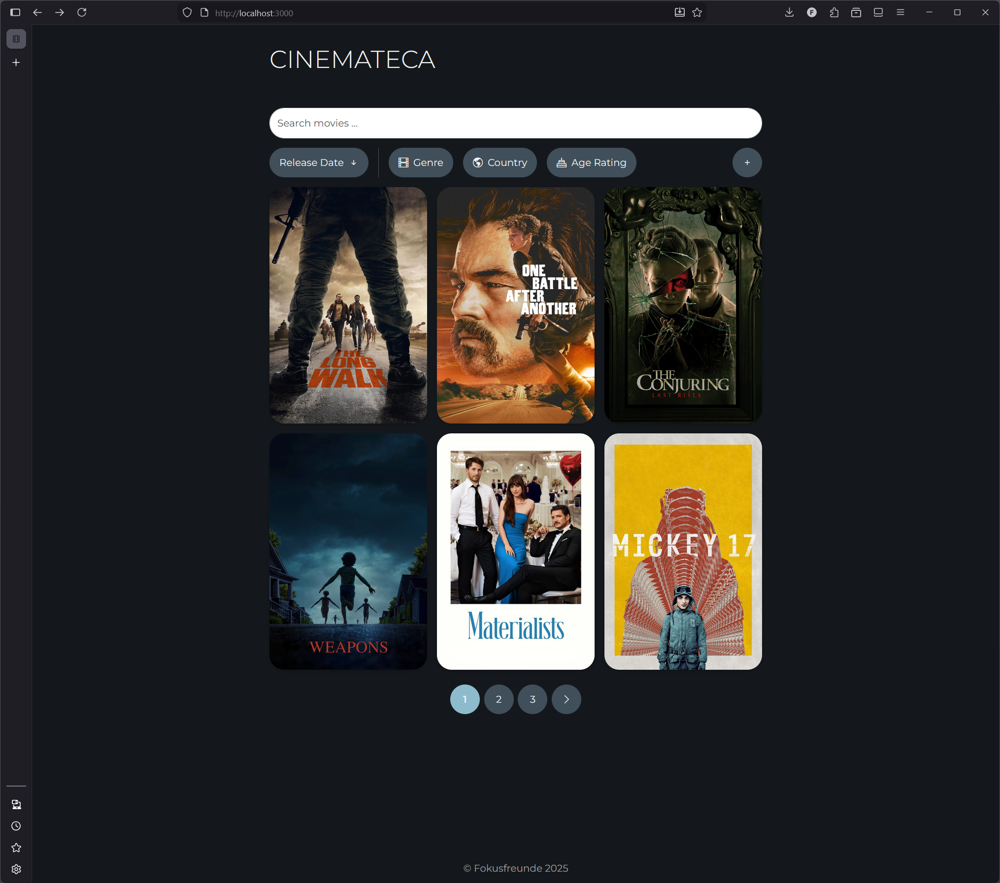
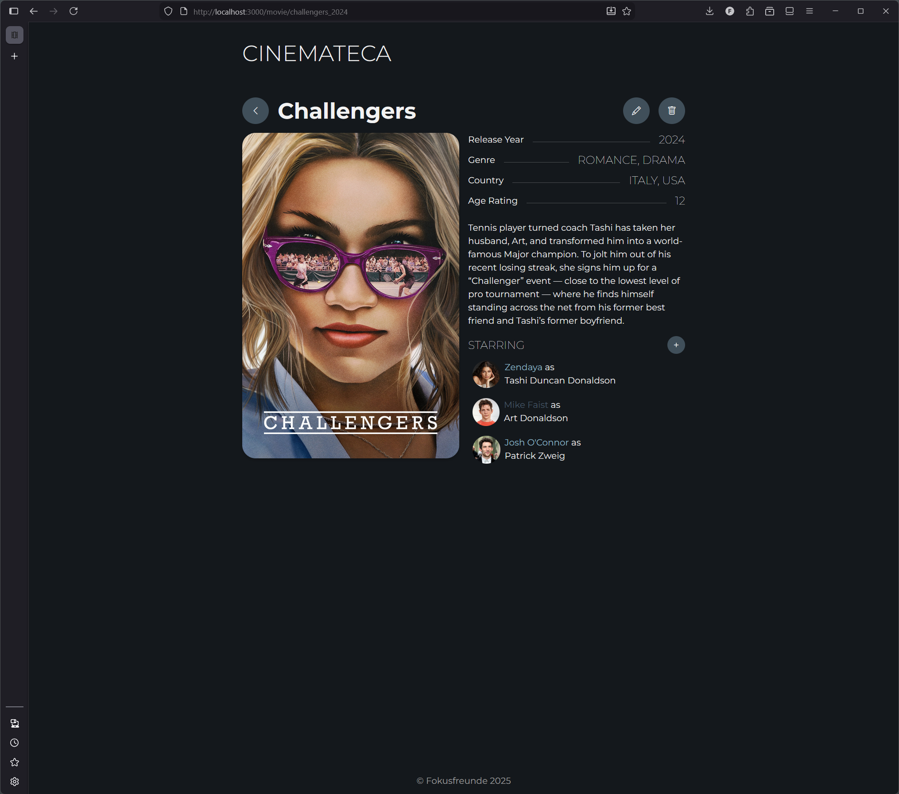
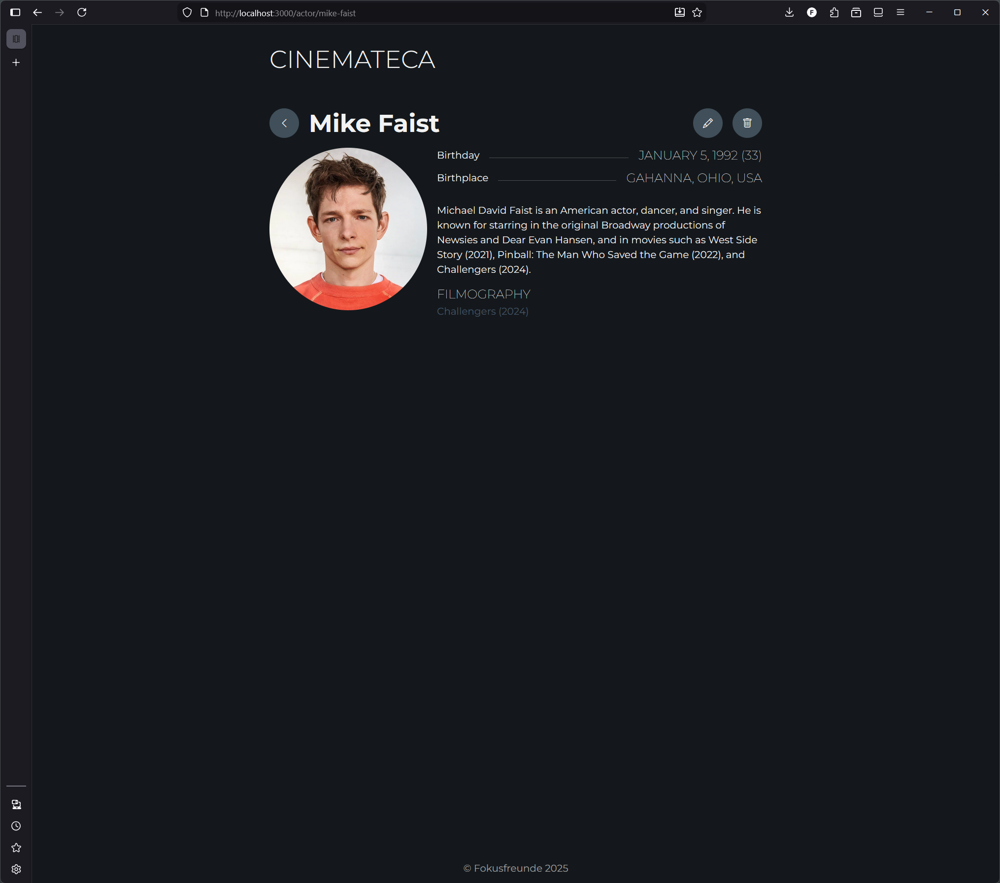
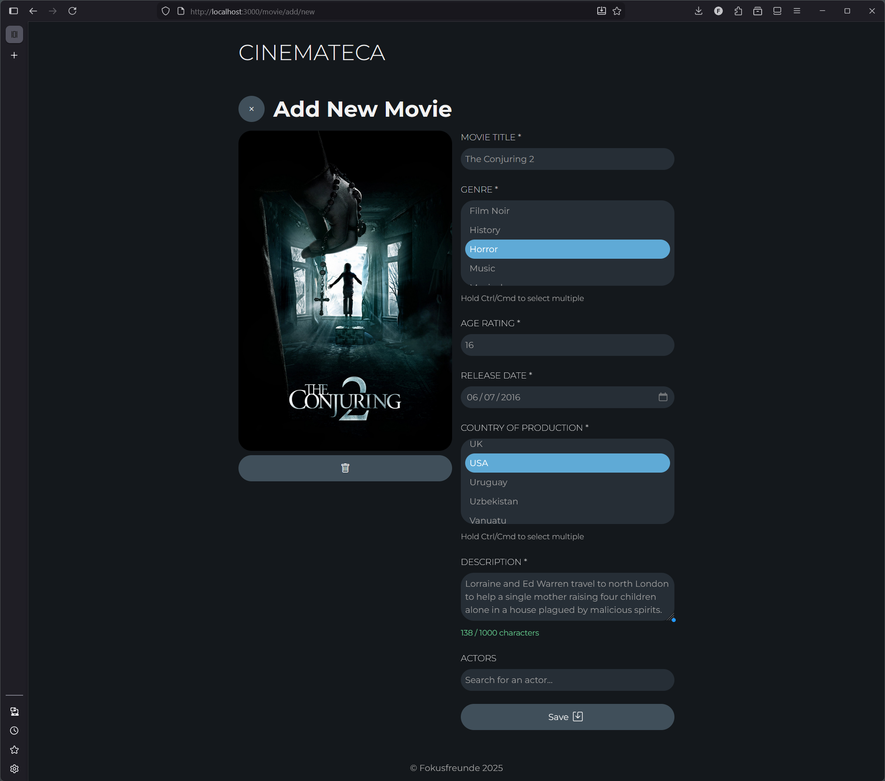
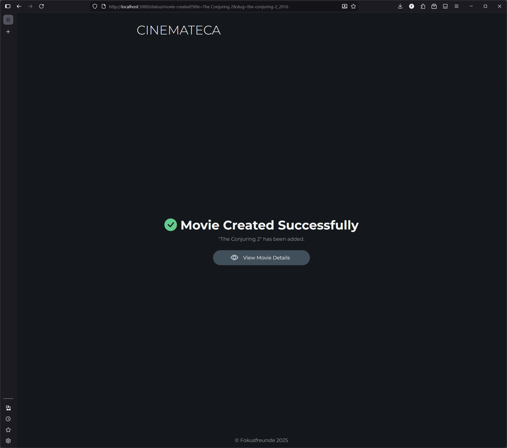
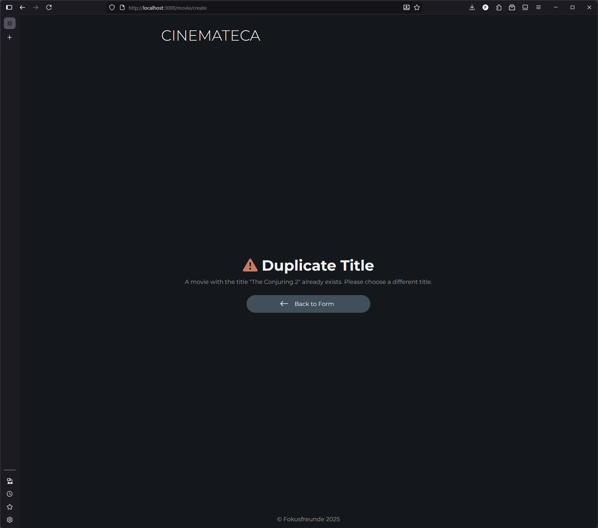
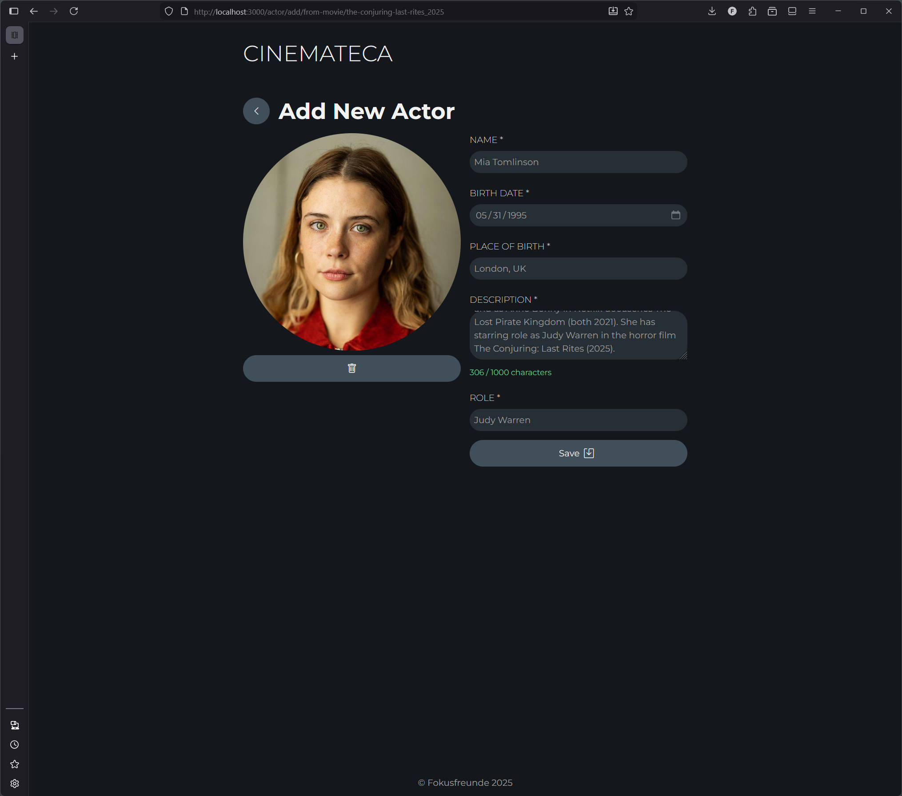

## Participation

### Alejandro
**Description of the Tasks Completed:**
My main focus throughout this second period was actors and actresses' management, I developed the corresponding functionality for the web app to be able to add new actors using a specific form that allows the user to upload the actor's portrait, introduce their name, date of birth, place of birth, description and role in the movie they are assigned to, with all of those fields being validated making sure they satisfy certain criteria, like using capital letters for the name, a valid birth date, etc. For the existing actors' editing and deleting functionalities, the specific person gets accessed via a slug that the system creates for each actor with our `slugify` file, giving access to their specific info, which allows the user to change any field in the actor's info or updating their portrait, being subjected to the same validation process when clicking "Update" in case there are any mistakes in the new data. Lastly, using the same slug mechanism, actors can now be deleted when clicking on the trash button either from a movie page, or the actor's view page, removing all information, including their portrait from the database.

**Five Most Significant Commits**
- [048dc8d](https://github.com/CodeURJC-FW-2025-26/webapp04/commit/048dc8df625aacb2d409825bf30964977e80d09f): Full functionality developed to edit an existing actor.
- [a90b078](https://github.com/CodeURJC-FW-2025-26/webapp04/commit/a90b078c7db3e944886b459b2e80d15ed1943b06): Full functionality developed to add a new actor.
- [e9fd89c](https://github.com/CodeURJC-FW-2025-26/webapp04/commit/e9fd89c5955da88bc7a29ae18f434221fde4fd69): Full functionality developed to remove an existing actor.
- [0ce2306](https://github.com/CodeURJC-FW-2025-26/webapp04/commit/0ce23066d22613afb18ce695ba051eaaa86fc41a): Adding and editing an actor form developed.
- [9d717f8](https://github.com/CodeURJC-FW-2025-26/webapp04/commit/9d717f847d91b8f85635598d47028dfdff001307): Changed portrait format to a circular image.

**Five Most Contributed Files**
- [`actorForm.html`](https://github.com/CodeURJC-FW-2025-26/webapp04/blob/main/views/partials/actorForm.html)
- [`actorCatalogue.js`](https://github.com/CodeURJC-FW-2025-26/webapp04/blob/main/src/actorCatalogue.js)
- [`actorValidator.js`](https://github.com/CodeURJC-FW-2025-26/webapp04/blob/main/src/utils/actorValidator.js)
- [`editActor.html`](https://github.com/CodeURJC-FW-2025-26/webapp04/blob/main/views/editActor.html)
- [`actorsManager.js`](https://github.com/CodeURJC-FW-2025-26/webapp04/blob/main/public/js/actorsManager.js)

### Farina
**Description of the Tasks Completed:**
A fully functional and reusable form was developed for both creating and editing movies (the primary entity). This included implementing image uploads to the uploads folder and ensuring that demo data is automatically copied there. The same approach was later extended to support actor portraits (the secondary entity).

To maintain data integrity, input validation was added to prevent duplicate entries in the database. When a movie is edited, all existing data is now reliably preloaded into the form.

Functionality was also introduced to search for existing actors and assign them to a movie along with their specific role. Additionally, the actor-creation workflow was improved so that any actor created directly from a movie’s page is immediately associated with that movie.

**Five Most Significant Commits**
- [1c09ff6](https://github.com/CodeURJC-FW-2025-26/webapp04/commit/1c09ff689dbb1d07159f160f57bc3dddc4daddc3): Edited `movieForm.html` and made it reusable
- [9d717f8](https://github.com/CodeURJC-FW-2025-26/webapp04/commit/0aae77b94697ac31ee0e4d05128f2eadd12e9d77): Added `imageUploader.js`
- [7c52b98](https://github.com/CodeURJC-FW-2025-26/webapp04/commit/7c52b986c0fa5d8808242425331e1d6cbdf17352): Updated form and added script for dynamic image preview
- [bd0b6b1](https://github.com/CodeURJC-FW-2025-26/webapp04/commit/bd0b6b14bfa7a5234e56c746225444558e515794): Implemented server-side form validation
- [c2bda2d](https://github.com/CodeURJC-FW-2025-26/webapp04/commit/c2bda2dd0c343e19073a095319b318b84ccbb22a): Created separate folders for poster and portrait image uploads

**Five Most Contributed Files**
- [`imageUploader.js`](https://github.com/CodeURJC-FW-2025-26/webapp04/blob/main/src/imageUploader.js)
- [`actorsManager.js`](https://github.com/CodeURJC-FW-2025-26/webapp04/blob/main/public/js/actorsManager.js)
- [`editMovie.html`](https://github.com/CodeURJC-FW-2025-26/webapp04/blob/main/views/editMovie.html)
- [`movieForm.html`](https://github.com/CodeURJC-FW-2025-26/webapp04/blob/main/views/partials/movieForm.html)
- [`router.js`](https://github.com/CodeURJC-FW-2025-26/webapp04/blob/main/src/router.js)

### Felix
**Description of the Tasks Completed:**
I prepared the project for Práctica 2 by setting up the folder structure, creating `app.js` and `router.js`, and adding the sample data as JSON files, which are automatically loaded into the database when the program starts. I configured the HTML pages to use Mustache templates, which render the data provided by the backend. I also added shared header and footer partials so that all views follow a consistent layout. In addition, I implemented pagination on the home page.

Furthermore, I configured most of the routes in `router.js` as well as the `movieCatalogue.js` and `actorCatalogue.js` modules, which act as interfaces to the database. I added searching, filtering, and sorting functionality on the home page together with the corresponding UI. I also implemented the status page, which serves as an intermediate page after user interactions, and added backend error-handling logic.

Once the main tasks were completed, I made several improvements: for cleaner URLs, I introduced a slug field in the sample data and used it instead of the database-generated IDs. Additionally, even though the relationship between movies and actors remains unidirectional, I expanded the data-loading process so that each actor is now also linked to their respective movies. I made some design adjustments on the movie and actor detail pages for better readability, and added logic to display when an actor is deceased.

Throughout the process, I regularly reviewed the code, removed duplicates, modularized functionality, and reorganized files to improve readability and maintainability.

**Five Most Significant Commits**
- [d1993a3](https://github.com/CodeURJC-FW-2025-26/webapp04/commit/d1993a3): Added search, filtering, and sorting functionality on the home page
- [7a98744](https://github.com/CodeURJC-FW-2025-26/webapp04/commit/7a98744): Introduced a status page and implemented backend logic to handle errors and successes and redirect appropriately
- [fce0d4c](https://github.com/CodeURJC-FW-2025-26/webapp04/commit/fce0d4c): Implemented pagination
- [c4665d9](https://github.com/CodeURJC-FW-2025-26/webapp04/commit/c4665d9) and [3fe8487](https://github.com/CodeURJC-FW-2025-26/webapp04/commit/3fe8487): Added slug fields to both JSON files for cleaner and more readable URLs
- [b24bb7d](https://github.com/CodeURJC-FW-2025-26/webapp04/commit/b24bb7d): Replaced duplicated header and footer HTML in the views with Mustache partials

**Five Most Contributed Files**
- [`router.js`](https://github.com/CodeURJC-FW-2025-26/webapp04/blob/main/src/router.js) (later split into multiple separate files for separation of concerns)
- [`movieCatalogue.js`](https://github.com/CodeURJC-FW-2025-26/webapp04/blob/main/src/movieCatalogue.js)
- [`home.js`](https://github.com/CodeURJC-FW-2025-26/webapp04/blob/main/public/js/home.js)
- [`statusPage.html`](https://github.com/CodeURJC-FW-2025-26/webapp04/blob/main/views/statusPage.html)
- [`errorHandler.js`](https://github.com/CodeURJC-FW-2025-26/webapp04/blob/main/src/utils/errorHandler.js)

# Práctica 3

- [Link to the Screen Recordung after Práctica 3](https://www.youtube.com/watch?v=aSp8bXJcYKA)

## How to Install and Run

Clone the repository:
```bash
git clone https://github.com/CodeURJC-FW-2025-26/webapp04.git
cd webapp04
```

Install dependencies:
```bash
npm install
```

**Note:** Ensure MongoDB is running on `localhost:27017` before starting the application.

Start the application:
```bash
npm start
```

Navigate to [`http://localhost:3000/`](http://localhost:3000/) in your browser to view the application.

## Description of the Created Files

### public/js/ (Client-Side JavaScript)

**Removed file**: `actorsManager.js`

- **`home.js`**: Main script for the home page with infinite scroll functionality.
  - Implements infinite scroll to load movies dynamically as the user scrolls down (replaced the previous pagination system) without full page reloads.
  - Fetches additional movies incrementally from `/api/search` using `skip` and `limit` parameters. Displays a loading spinner while fetching data.
  - Provides real-time movie search, multi-select filtering and sorting options.


- **`statusModal.js`**: Reusable feedback dialog that shows success or error messages in a Bootstrap modal.
  - Replaces intermediate status pages with in-page modals.
  - Used throughout the application after create/update/delete operations and supports both dismissible and redirect-required modal states.


- **`confirmationModal.js`**: Reusable confirmation dialog for destructive actions.
  - Displays a Bootstrap modal with customizable title and message, accepts callback functions for confirm and cancel actions.
  - Shows loading state with spinner during async operations.
  - Is used before deleting movies or actors to prevent accidental deletions.


- **`utils.js`**: Shared utility library providing reusable functionality across the application.
  - `setupDeleteButton()` handles entity deletion with confirmation modal integration
  - form validation functions for validating text fields, dates, multi-selects, and capitalized strings
  - dynamic character counter with color-coded feedback
  - drag-and-drop image uploader with preview and file validation
  - generic AJAX form submission with spinner
  - client/server validation and validation state management using Bootstrap validation classes


- **`movie.js`**: Movie detail page interactivity.
  - Initializes the movie delete button using `utils.js` and `confirmationModal.js`
  - Sets up actor removal buttons for each actor in the movie's cast list
  - Makes AJAX DELETE requests to `/api/movie/{movieSlug}/actor/{actorSlug}` to remove actors, and updates the DOM dynamically after actor removal without page reload


- **`actor.js`**: Actor detail page interactivity. Simple initialization script for the actor detail page that sets up the actor delete button using `utils.js`.


- **`movieForm.js`** (renamed from `addNewMovie.js`): Movie add/edit form handler with AJAX submission.
  - Handles both creating new movies and editing existing movies via AJAX, prevents full page reloads on form submission
  - Uses `utils.js` for character counter on description field and for image upload with drag-and-drop/preview/removal
  - Performs client-side validation for all required fields, validates title starts with capital letter and date is within valid range
  - Displays validation errors beneath corresponding input fields using Bootstrap styles
  - Shows a loading spinner during submission
  - Displays success/error modal after submission using `statusModal.js`


- **`actorForm.js`** (renamed from `addNewActor.js`): Actor add/edit form handler with AJAX submission. 
  - Handles both creating new actors and editing existing actors via AJAX, prevents full page reloads on form submission
  - Uses `utils.js` for character counter on description field and for portrait image upload with drag-and-drop/preview/removal
  - Performs client-side validation for required fields, validates name starts with capital letter and birthday is within valid range
  - Displays validation errors beneath corresponding input fields using Bootstrap styles
  - Shows a loading spinner during submission
  - Displays success/error modal after submission using `statusModal.js`
  - Supports optional callback for post-submission actions

---

### src/ (Server-Side Code)

- **`app.js`**: Application entry point. No major changes from Práctica 2, but now supports JSON responses for AJAX requests.


- **`constants.js`**: Centralized configuration file. No changes from Práctica 2.


- **`database.js`**: Database connection module. No changes from Práctica 2.


- **`dataLoader.js`**: Demo data initialization. No changes from Práctica 2.


- **`router.js`**: Main application router. Removed pagination and status page router as pagination is now handled by infinite scroll and status feedback uses modals.


- **`imageHandler.js`** (renamed from `imageUploader.js`): Image file management utilities. No major changes from Práctica 2, only added `deleteUploadedFile()` to remove image files when entities are deleted or images are replaced.


- **`movieCatalogue.js`**: Database operations for movies. No changes from Práctica 2.


- **`actorCatalogue.js`**: Database operations for actors. No changes from Práctica 2.

---

### src/routes/

**Removed file**: `statusRoutes.js` - Status and confirmation pages are now handled by client-side modals.


- **`movieRoutes.js`**: Router for movie-related endpoints, uses `MovieService` for business logic. Updated to support AJAX form submissions, returning JSON errors for validation failures. Returns JSON for AJAX requests, HTML pages for traditional requests.
    - `GET /add/new` - Form to add a new movie
    - `GET /edit/:movieSlug` - Form to edit an existing movie
    - `POST /create` - Create new movie
    - `POST /update/:movieSlug` - Update movie
    - `GET /moviePosters/:filename` - Serve movie poster images
    - `GET /:movieSlug/poster` - Download movie poster by slug
    - `GET /:movieSlug/actors` - Get actors section partial for movie detail page (used for dynamic updates)
    - `GET /:movieSlug` - Movie detail page


- **`actorRoutes.js`**: Router for actor-related endpoints, uses `ActorService` for business logic. Updated to support AJAX form submissions with JSON error/success responses. Returns JSON for AJAX requests, HTML pages for traditional requests.
    - `GET /add/in-movie/:movieSlug` - Partial form to add an actor within movie detail page
    - `GET /edit/:actorSlug/in-movie/:movieSlug` - Partial form to edit an actor within movie detail page
    - `GET /edit/:actorSlug` - Form to edit an existing actor (from actor detail page)
    - `POST /create` - Create new actor
    - `POST /update/:actorSlug` - Update actor
    - `POST /update/:actorSlug/from-movie/:movieSlug` - Update actor from movie context
    - `GET /:slug` - Actor detail page
    - `GET /portraits/:filename` - Serve actor portrait images


- **`apiRoutes.js`**: RESTful API endpoints returning JSON responses. All endpoints return structured JSON with `success`, `title`, `message`, and optional `redirect` fields.
    - `GET /search` - Search and filter movies with pagination support (`skip`, `limit` parameters). Returns paginated movie results for infinite scroll and supports search query, filtering and sorting.
    - `DELETE /movie/:slug` - Delete a movie
    - `DELETE /movie/:movieSlug/actor/:actorSlug` - Remove an actor from a movie. Updates movie in database without deleting the actor entity.
    - `DELETE /actor/:slug` - Delete an actor completely

---

### src/services/

- **`MovieService.js`**: Business logic for movie operations. Enhanced validation to allow updating a movie without changing its title (checks if title belongs to same movie). Supports optional posters with placeholder fallback as well as deletion of posters. Updated error handling to reflect new JSON format. 
  - `getMovieActorsForDisplay(slug)` fetches only the actors for a specific movie, used for dynamic updates after adding/removing actors


- **`ActorService.js`**: Business logic for actor operations. Enhanced validation to allow updating an actor without changing its name (checks if name belongs to same actor). Supports optional portraits with placeholder fallback as well as deletion of portraits. Updated error handling to reflect new JSON format.


- **`SearchService.js`**: Search and filtering operations. No major changes from Práctica 2.

---

### src/middleware/

- **`errorHandler.js`**: Error handling middleware. Enhanced to support both HTML page rendering and JSON responses depending on request type. Functions include:
    - `renderErrorPage(res, errorType, entity, details)` - Renders HTML error page for traditional requests
    - `sendJsonErrorPage(res, errorType, entity, details, status)` - Returns JSON error response for general errors
    - `sendJsonValidationError(res, errorType, entity, details)` - Returns JSON with validation errors for form fields
    - `sendJsonDuplicateError(res, entity, field, value)` - Returns JSON error when duplicate entry is detected
    - `sendJsonNotFoundError(res, entity)` - Returns JSON error for 404 Not Found (AJAX requests)
    - `sendJsonServerError(res, operation)` - Returns JSON error for 500 Server Error (AJAX requests)


- **`pagination.js`**: Pagination middleware still exists and is used for initial page load to calculate `skip` and `limit` parameters, but infinite scroll now handles subsequent data loading on the client side.

---

### src/utils/

- **`movieValidator.js`**: Server-side validation for movie data. Updated error handling to reflect new JSON format.


- **`actorValidator.js`**: Server-side validation for actor data. Updated error handling to reflect new JSON format.


- **`errors.js`**: Custom error classes for consistent error handling. Includes:
  - `ValidationError` (thrown when validation fails)
  - `NotFoundError` (thrown when entity is not found)
  - `DuplicateError` (thrown when attempting to create duplicate entry)
  - Used throughout services to provide meaningful error information. No changes from Práctica 2.


- **`errorHandler.js`** (utils): Error detail generation helpers. Updated error handling to reflect new JSON format. Now only handles `notFound` and `unknown` errors as validation is no longer feedbacked via status pages.


- **`routeHelpers.js`**: Utility functions for routes. Functions to delete image files moved to `imageHandler.js`.


- **`slugify.js`**: URL slug generation. No changes from Práctica 2.


- **`statusPageHelper.js`**: Status page data generation. Less frequently used in Práctica 3 due to modal-based feedback. Removed function to create success status page and mapping of validation errors to HTTP status codes.

---

## views

Generally, only minor changes in most views due to renames or minor design changes.

- **`home.html`**: Added placeholder movie poster as fallback and removed pagination controls.


- **`movie.html`**: Added placeholder movie poster as fallback and moved actor section to separate view `actorSection.html`.


- **`actor.html`**: No significant changes from Práctica 2.


- **`editMovie.html`**: No significant changes from Práctica 2.


- **`editActor.html`**: No significant changes from Práctica 2.

---

### views/partials/

- **`baseHead.html`**: Added styles and scripts for modals (`statusModal.js`, `confirmationModal.js`).


- **`actorSection.html`**: Partial view displaying the cast section on movie detail page.


- **`movieForm.html`**: Removed HTML validations in form elements and replaced with custom JavaScript validations to display errors beneath input fields. Added loading spinner for form submission.


- **`actorForm.html`**: Added support for compact view on movie detail page. Removed HTML validations in form elements and replaced with custom JavaScript validations to display errors beneath input fields. Added loading spinner for form submission.


- **`statusModal.html`**: Bootstrap modal partial for displaying status messages. Reusable modal dialog with customizable icon, title, and message. Supports two button modes: dismiss (close) or redirect (navigate to URL). Used to show success/error feedback after operations.


- **`confirmationModal.html`**: Bootstrap modal partial for confirmation dialogs. Displays warning icon with customizable title and message. Two-button layout: Cancel and Confirm. Shows loading spinner during async operations.


## Screenshots

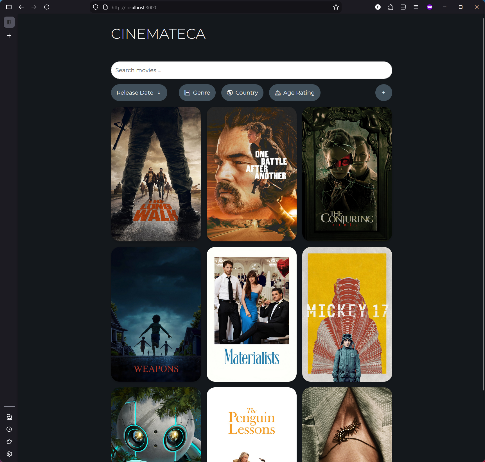
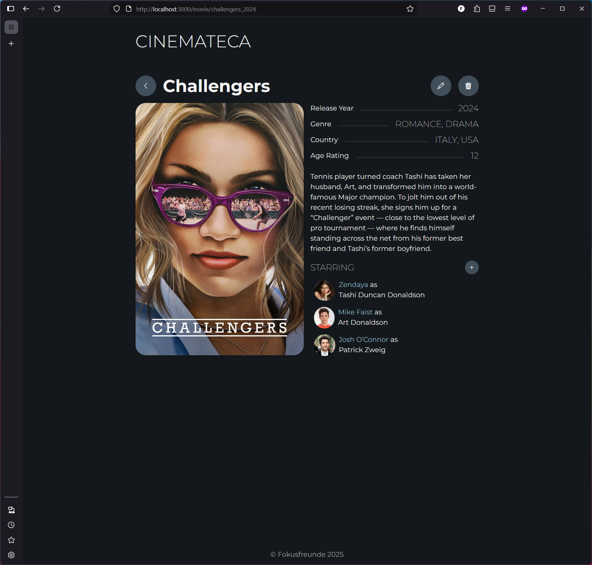
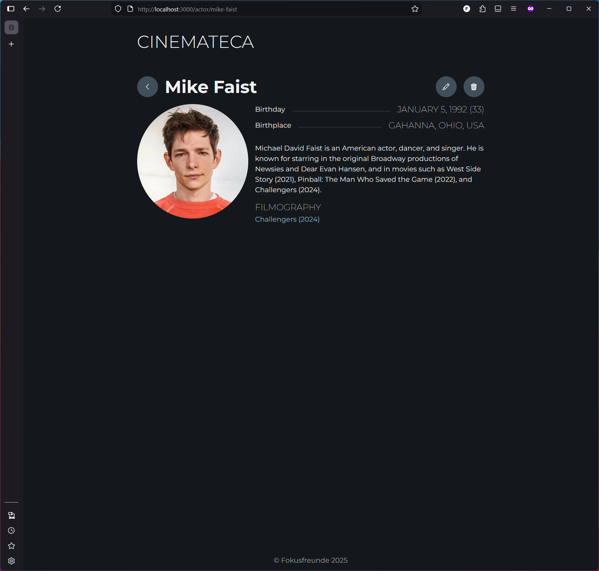
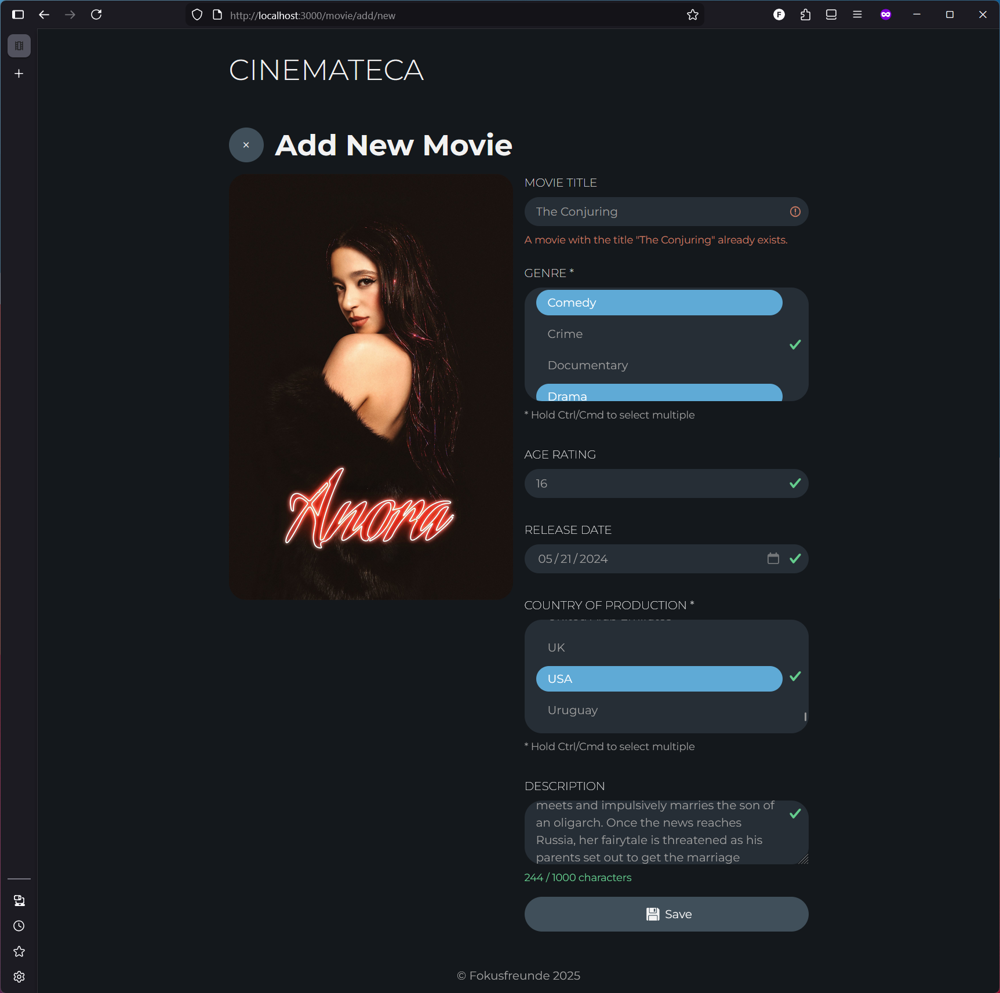
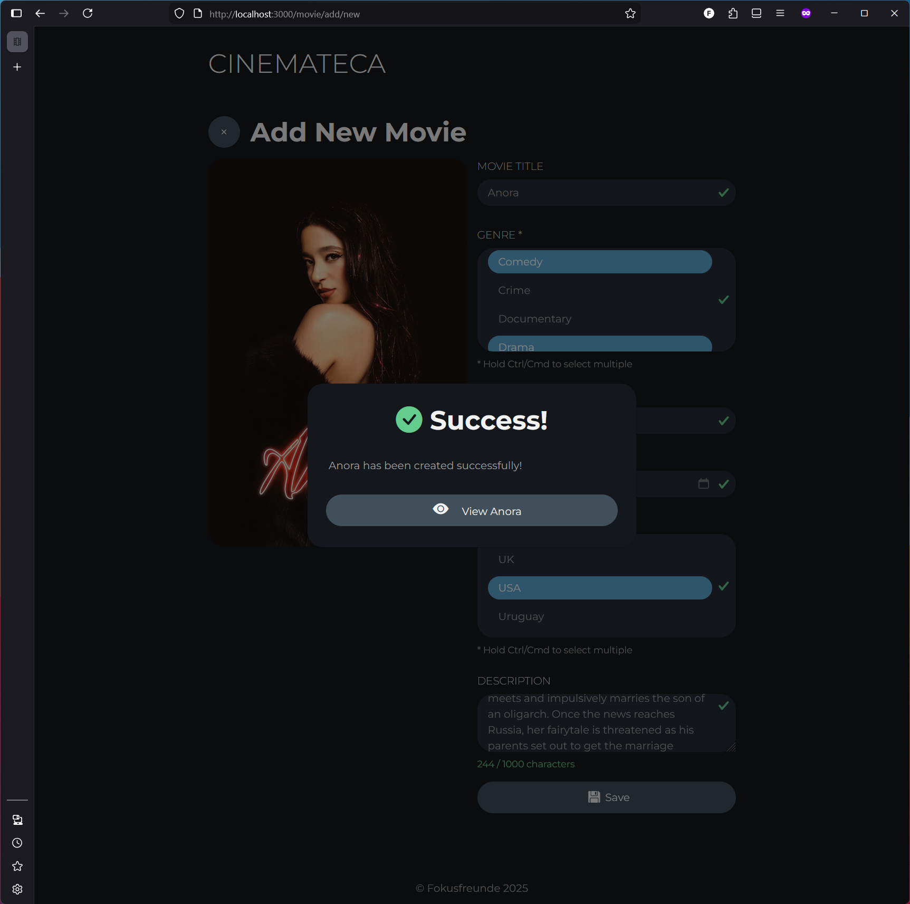
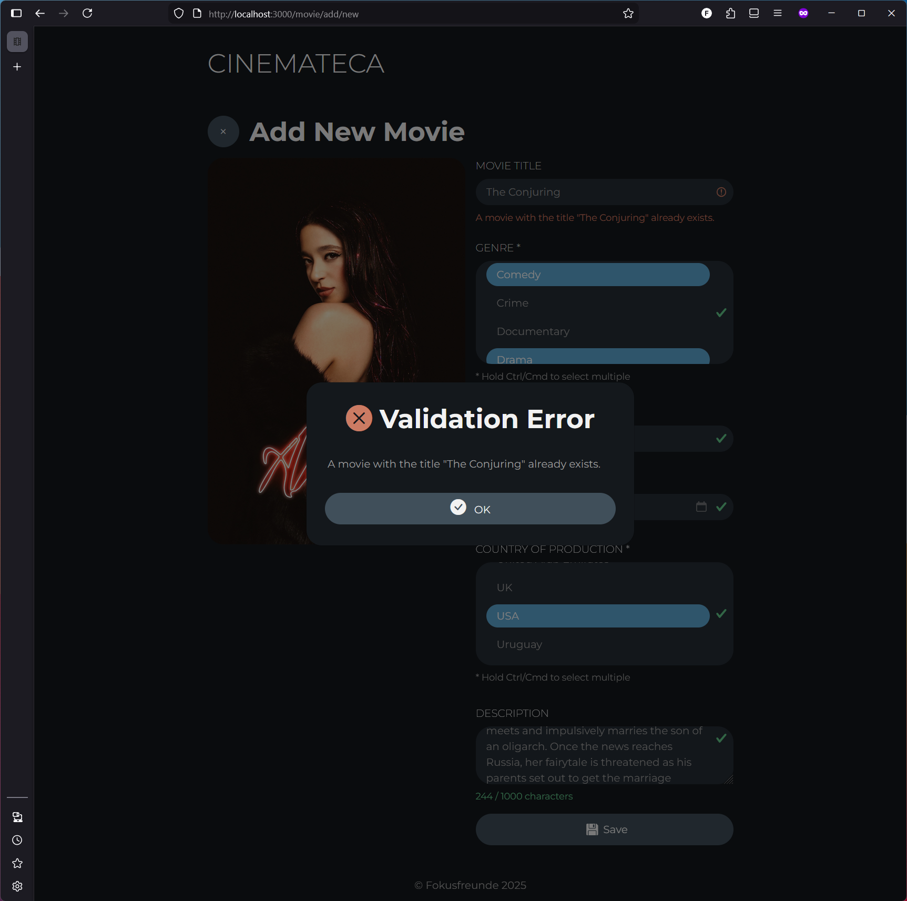
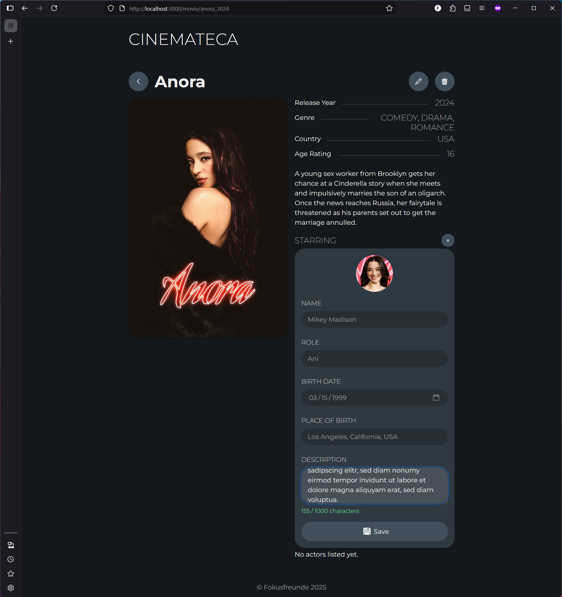

## Participation

### Alejandro
**Description of the Tasks Completed:**
...

**Five Most Significant Commits**
- ...
- ...

**Five Most Contributed Files**
- ...
- ...

### Farina
**Description of the Tasks Completed:**
...

**Five Most Significant Commits**
- ...
- ...

**Five Most Contributed Files**
- ...
- ...

### Felix
**Description of the Tasks Completed:**
I implemented infinite scroll and replaced intermediate status pages with Bootstrap modals. On the movie detail pages I added actor deletion without a page reload. For both infinite scroll and form submissions I implemented a spinner that displays while the server processes requests. I also added Bootstrap-styled validation error messages under the corresponding input fields and a modal to inform users when form submission fails.

Additionally, I added more sample data to demonstrate infinite scroll and included a placeholder image for movie posters now that posters are optional.

I restyled the delete button on movie posters and actor portraits so it appears over the poster and becomes visible on hover. (In Práctica 2, Farina already implemented image preview and a remove-button under the preview.)

Farina and I replaced the old redirect-based error handling to work with the new modals.

Throughout the project I continuously reviewed the code to remove bugs and redundancy, promoted code reuse, and cleaned up dead code.

**Five Most Significant Commits**
- [cd8ce7f](https://github.com/CodeURJC-FW-2025-26/webapp04/commit/cd8ce7f): Replaced pagination with infinite scroll
- [c0f1957](https://github.com/CodeURJC-FW-2025-26/webapp04/commit/c0f1957) and [b719ae7](https://github.com/CodeURJC-FW-2025-26/webapp04/commit/b719ae7): Added modals instead of intermediate pages
- [e718d42](https://github.com/CodeURJC-FW-2025-26/webapp04/commit/e718d42): Deletion of `Actor`s on `Movie` detail page
- [2c5a195](https://github.com/CodeURJC-FW-2025-26/webapp04/commit/2c5a195) and [e41d588](https://github.com/CodeURJC-FW-2025-26/webapp04/commit/e41d588): Added display of error messages beneath input fields
- [0664aba](https://github.com/CodeURJC-FW-2025-26/webapp04/commit/0664aba) and [175b537](https://github.com/CodeURJC-FW-2025-26/webapp04/commit/175b537): Fixed a bug that allowed in edit forms to change the title of a movie or name of an actor to an already existing title/name

**Five Most Contributed Files**
- `home.js`
- `statusModal.js` with `statusModal.html`
- `confirmationModal.js` with `confirmationModal.html`
- `movie.js`
- `utils.js`
