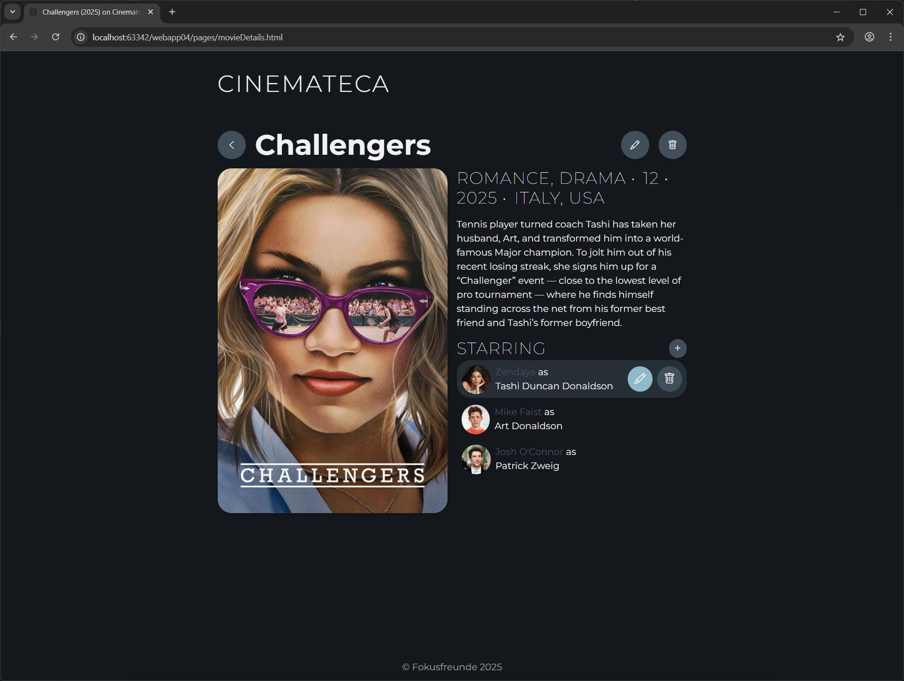
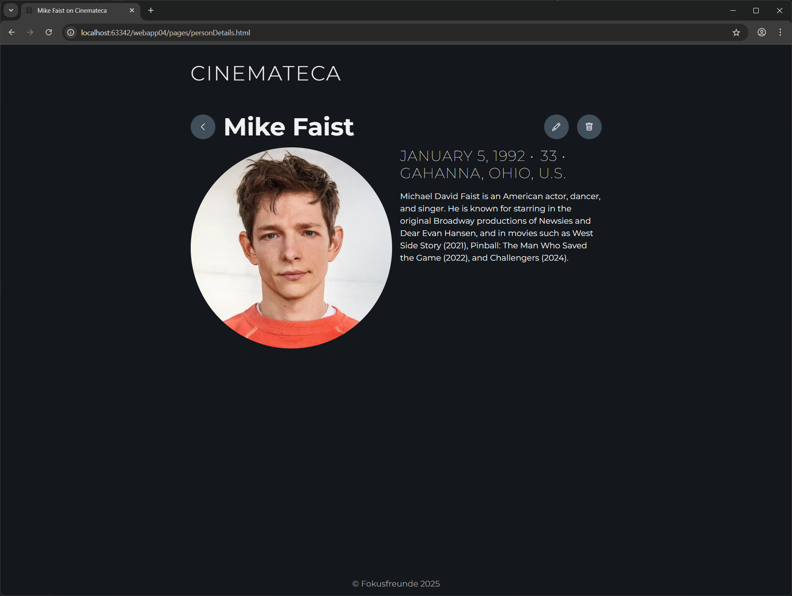

# Cinemateca
Cinemateca is a web application that serves as a comprehensive movie catalog, allowing users to browse and search a vast database of films.

**Table of contents**
<!-- TOC -->
* [Members of the Group](#members-of-the-group)
* [Links](#links)
* [Functionality](#functionality)
* [Wireframes](#wireframes)
* [Práctica 1](#práctica-1)
* [Práctica 2](#práctica-2)
* [Práctica 3](#práctica-3)
<!-- /TOC -->

## Members of the Group
* Alejandro Guzmán Sánchez (E-Mail: a.guzmans.2025@urjc.es, GitHub: [AlejandroGS47](https://github.com/AlejandroGS47))
* Farina Schlegel (E-Mail: f.schlegel.2025@alumnos.urjc.es, GitHub: [frinnana](https://github.com/frinnana))
* Felix Schwabe (E-Mail: f.schwabe.2025@alumnos.urjc.es, GitHub: [7dns](https://github.com/7dns))

## Links
[Link to Trello](https://trello.com/invite/b/68d0f24f8deb98189ef954eb/ATTI17034f224bc8ee2a098984e95cb7a264E5C95465/cinemateca)

## Functionality
### Entities

#### Movies
`Movie` is the primary entity of the web application. Each `Movie` contains essential information and is linked to its actors. Each `Movie` has at least one actor.

A `Movie` has:
* unique ID,
* title,
* poster (image file),
* short description,
* genre,
* release year,
* country of production,
* age rating,
* one or more actors

#### Person
The secondary entity in the application is `Person`. A `Person` is someone who acts in a `Movie`. *(Optional: A `Person` may also represent any individual involved in at least one `Movie`, such as an actor, director or writer. Every `Person` must be linked to at least one movie.)*

A `Person` has:
* unique ID,
* name
* portrait (image file),
* date of birth,
* place of birth,
* short description

### Search
The application will include a search function that allows users to find movies by their title. *(Optional: Users may also enter the name of a person (e.g. actor, director or writer) involved in the movie.)*

### Filtering
The application will include a function to filter search results (e.g. by genre, release year or country of production).

## Wireframes
The following wireframes show the planned layout of Cinemateca, giving a visual overview of the application’s structure and functionality.

### Wide Screen Views

### Mobile Views

# Práctica 1

## Screenshots

## Participation

### Alejandro
**Description of the Tasks Completed:**
By the time I joined the team, the initial idea of the project had already been developed by Farina and Felix, so a lot of progress had already been done, specially the main functionalities for the app. Having this in mind, I focused entirely on improving some elements to make it more visually attractive. One of my main tasks was changing our movie catalog grid layout from CSS to Bootstrap, which now has the possibility to adapt to the different screen widths, decreasing the amount of columns when the screen is narrow, making it only one column for mobile devices and three columns for wider screens. Also, using CSS, I developed a hover effect for the movie posters in our catalog to show each movie's name and year of production when the cursor is placed over the poster using a smooth transition. My third contribution to the project so far was making the text size in the "Movie details" page increase or decrease depending on the screen width so the text doesn't jump so many lines and gets unaligned with the movie poster and the rest of the content. Finally, I added the favicon for all HTML pages through the website. 

**Five Most Significant Commits**
- [6c372c9](https://github.com/CodeURJC-FW-2025-26/webapp04/commit/6c372c96682bb107b79db84d25ee046e55d4f484): Replaced CSS only grid layout to Bootstrap grid layout adaptable to screen width, making the movie catalog responsive.
- [ce5cd65](https://github.com/CodeURJC-FW-2025-26/webapp04/commit/ce5cd65518adc315fed08228daab3a0def63dda4): Developed the hover effect to show the movie name and year of production on our homepage catalog.
- [853488a](https://github.com/CodeURJC-FW-2025-26/webapp04/commit/853488a9afcb5599a0f5aa379a7953fad719c41f): Made the font size on the "Movie details" page adapt to screen width to keep it aligned to the movie poster.
- [3bfb634](https://github.com/CodeURJC-FW-2025-26/webapp04/commit/3bfb634732e53195379000da9cdf4b884636756d): Made the pictures in movie posters cover their whole container, making it more visually appealing.
- [b9cf5ce](https://github.com/CodeURJC-FW-2025-26/webapp04/commit/b9cf5ceb852b3bfa1d7a86837246620ef96ae9fd): Added the favicon to all HTML pages through the website. 

**Five Most Contributed Files**
- [`index.html`](https://github.com/CodeURJC-FW-2025-26/webapp04/blob/main/pages/index.html)
- [`general.css`](https://github.com/CodeURJC-FW-2025-26/webapp04/blob/main/styles/general.css)
- [`movieDetails.css`](https://github.com/CodeURJC-FW-2025-26/webapp04/blob/main/styles/movieDetails.css)
- [`movieDetails.html`](https://github.com/CodeURJC-FW-2025-26/webapp04/blob/main/pages/movieDetails.html)
- [`addNewMovie.html`](https://github.com/CodeURJC-FW-2025-26/webapp04/blob/main/pages/addNewMovie.html)

### Farina
**Description of the Tasks Completed:**
At the beginning of the project, I worked together with Felix to develop the initial concept for our web application. We documented our ideas in the README file and created the first wireframes. Later, I focused mainly on the visual aspects of the web app. I contributed to the CSS styling and helped ensure that the overall design remained visually consistent across all pages. During this phase, I also familiarized myself with the Bootstrap framework and used it to improve the structure of certain layouts. I integrated the Bootstrap Icons library and added icons to all buttons across the application to create a more intuitive and uniform interface. In addition, I was mainly responsible for styling the `addNewMovie.html`, making sure it aligned with the overall look and feel of the project.

**Five Most Significant Commits**
- [9f57e80](https://github.com/CodeURJC-FW-2025-26/webapp04/commit/9f57e80eee313b6c282380eb65b843b5cbaa9b15): Replaced text-based buttons with Bootstrap icons across multiple pages to create a cleaner and more consistent interface.
- [f9b51c7](https://github.com/CodeURJC-FW-2025-26/webapp04/commit/f9b51c73dc61aca82cbbc9ac525f04cd587bc406): Added missing icons to buttons on `addNewMovie.html` and `personDetails.html` to ensure consistent visual design across pages.
- [e83fe7b](https://github.com/CodeURJC-FW-2025-26/webapp04/commit/e83fe7ba1104e15f8e2f75252bc4f6473b4dc642): Updated the README file and wireframes together with Felix to document the initial project idea and design concept.
- [f4f0968](https://github.com/CodeURJC-FW-2025-26/webapp04/commit/f4f0968f37aa774c384106ea363f1be151b9e4f2): Styled `addNewMovie.html` and refined `addNewMovie.css` to define the overall layout and color scheme for the page.
- [1869d91](https://github.com/CodeURJC-FW-2025-26/webapp04/commit/1869d91ccf7b724d6b6e58754b5bee4b272e0880): Improved hover behavior and interaction logic between icons and buttons in `general.css` to ensure consistent visual feedback.

**Five Most Contributed Files**
- [`general.css`](https://github.com/CodeURJC-FW-2025-26/webapp04/blob/main/styles/general.css)
- [`addNewMovie.css`](https://github.com/CodeURJC-FW-2025-26/webapp04/blob/main/styles/addNewMovie.css)
- [`variables.css`](https://github.com/CodeURJC-FW-2025-26/webapp04/blob/main/styles/variables.css)
- [`README.md`](https://github.com/CodeURJC-FW-2025-26/webapp04/README.md) documented project ideas together with Felix
- Felix and I worked together on the wireframes while developing the project idea

### Felix
**Description of the Tasks Completed:**
Before Alejandro joined the group, Farina and I developed the initial idea for our project and created the wireframes along with the UML class diagram.
I implemented the first version of all four HTML pages and their corresponding CSS files. Early on, I continuously refined the CSS to eliminate redundancies and ensure a consistent design across all pages. To achieve this, I created separate CSS files to store shared variables and common styles. I also made sure that the header and footer were consistent on every page.
When Bootstrap was introduced in class, I refactored some of the existing CSS grids to use Bootstrap’s grid system instead.
I added hover effects to the buttons for the secondary entities (the actors) in `movieDetails.html` to allow editing and deleting them.
Finally, I verified that all pages were fully responsive and made some last adjustments.

**Five Most Significant Commits**
- [d3f02d5](https://github.com/CodeURJC-FW-2025-26/webapp04/commit/d3f02d5a08640904ea29045cf7774de73a87f1dc): Documented the initial project ideas in the README file together with Farina.
- [324bd1a](https://github.com/CodeURJC-FW-2025-26/webapp04/commit/324bd1ab063eac974a9d8dfe2eb4b577bbc490b7): Realized the first wireframes as HTML pages (`index.html`, `movieDetails.html`, and `personDetails.html`) with CSS. 
- [4b83b8a](https://github.com/CodeURJC-FW-2025-26/webapp04/commit/4b83b8ad5ee8b023b5ce10b58884bf99b2cd9275): Built an initial prototype of the “Add New Primary Entity” feature (`addNewMovie.html`) with CSS. 
- [e4f6304](https://github.com/CodeURJC-FW-2025-26/webapp04/commit/e4f6304aaaeb0ac3b578ed944d5c7bad36b21625): Refactored the CSS structure to include common styles in a shared CSS file and defined reusable values in a separate file for future reuse. 
- [9a4f26f](https://github.com/CodeURJC-FW-2025-26/webapp04/commit/9a4f26f1b65f8a8b885e1db86843ddfd50a25a27): Improved the responsiveness of `movieDetails.html`, particularly the hover effect in the actors list, and `personDetails.html`.

**Five Most Contributed Files**
- [`movieDetails.html`](https://github.com/CodeURJC-FW-2025-26/webapp04/blob/main/pages/movieDetails.html)
- [`personDetails.html`](https://github.com/CodeURJC-FW-2025-26/webapp04/blob/main/pages/personDetails.html)
- [`variables.css`](https://github.com/CodeURJC-FW-2025-26/webapp04/blob/main/styles/variables.css)
- [`pageLayout.css`](https://github.com/CodeURJC-FW-2025-26/webapp04/blob/main/styles/pageLayout.css)
- all images files used for [movie posters](https://github.com/CodeURJC-FW-2025-26/webapp04/tree/main/images/moviePosters) and [actor portraits](https://github.com/CodeURJC-FW-2025-26/webapp04/tree/main/images/persons)

# Práctica 2

## Screenshots

## Participation

### Alejandro
**Description of the Tasks Completed:**
My main focus throughout this second period was actors and actresses' management, I developed the corresponding functionality for the web app to be able to add new actors using a specific form that allows the user to upload the actor's portrait, introduce their name, date of birth, place of birth, description and role in the movie they are asigned to, with all of those fields being validated making sure they satisfy certain criteria, like using capital letters for the name, a valid birth date, etc. For the existing actors' editing and deleting functionalities, the specific person gets accessed via a slug that the system creates for each actor with our "slugify" file, giving access to their specific info, which allows the user to change any field in the actor's info or updating their portrait, being subjected to the same validation process when clicking "Update" in case there are any mistakes in the new data. Lastly, using the same slug mechanism, actors can now be deleted when clicking on the trash button either from a movie page, or the actor's view page, removing all information, including their portrait from the database.
...

**Five Most Significant Commits**
- [048dc8d](https://github.com/CodeURJC-FW-2025-26/webapp04/commit/048dc8df625aacb2d409825bf30964977e80d09f): Full functionality developed to edit an existing actor.
- [a90b078](https://github.com/CodeURJC-FW-2025-26/webapp04/commit/a90b078c7db3e944886b459b2e80d15ed1943b06): Full functionality developed to add a new actor.
- [e9fd89c](https://github.com/CodeURJC-FW-2025-26/webapp04/commit/e9fd89c5955da88bc7a29ae18f434221fde4fd69): Full functionality developed to remove an existing actor.
- [0ce2306](https://github.com/CodeURJC-FW-2025-26/webapp04/commit/0ce23066d22613afb18ce695ba051eaaa86fc41a): Adding and editing an actor form developed.
- [9d717f8](https://github.com/CodeURJC-FW-2025-26/webapp04/commit/9d717f847d91b8f85635598d47028dfdff001307): Changed portrait format to a circular image.

**Five Most Contributed Files**
- [`actorForm.html`](https://github.com/CodeURJC-FW-2025-26/webapp04/blob/main/views/partials/actorForm.html)
- [`actorCatalogue.js`](https://github.com/CodeURJC-FW-2025-26/webapp04/blob/main/src/actorCatalogue.js)
- [`actorValidator.js`](https://github.com/CodeURJC-FW-2025-26/webapp04/blob/main/src/utils/actorValidator.js)
- [`editActor.html`](https://github.com/CodeURJC-FW-2025-26/webapp04/blob/main/views/editActor.html)
- [`actorsManager.js`](https://github.com/CodeURJC-FW-2025-26/webapp04/blob/main/public/js/actorsManager.js)

### Farina
**Description of the Tasks Completed:**
...

**Five Most Significant Commits**
- ...
- ...

**Five Most Contributed Files**
- ...
- ...

### Felix
**Description of the Tasks Completed:**
I prepared the project for Práctica 2 by setting up the folder structure, creating `app.js` and `router.js`, and adding the sample data as JSON files, which are automatically loaded into the database when the program starts. I configured the HTML pages to use Mustache templates, which render the data provided by the backend. I also added shared header and footer partials so that all views follow a consistent layout. In addition, I implemented pagination on the home page.

Furthermore, I configured most of the routes in `router.js` as well as the `movieCatalogue.js` and `actorCatalogue.js` modules, which act as interfaces to the database. I added searching, filtering and sorting functionality on the home page together with the corresponding UI. I also implemented the status page, which serves as an intermediate page after user interactions, and added backend error-handling logic.

Once the main tasks were completed, I made several improvements: for cleaner URLs, I introduced a slug field in the sample data and used it instead of the database-generated IDs. Additionally, even though the relationship between movies and actors remains unidirectional, I expanded the data-loading process so that each actor is now also linked to their respective movies. I made some design adjustments on the movie and actor detail pages for better readability, and added logic to display when an actor is deceased.

Throughout the process, I regularly reviewed the code, removed duplicates, modularized functionality, and reorganized files to improve readability and maintainability.

**Five Most Significant Commits**
- [d1993a3](https://github.com/CodeURJC-FW-2025-26/webapp04/commit/d1993a3): Added search, filtering, and sorting functionality on the home page
- [7a98744](https://github.com/CodeURJC-FW-2025-26/webapp04/commit/7a98744): Introduced a status page and implemented backend logic to handle errors and successes and redirect appropriately
- [fce0d4c](https://github.com/CodeURJC-FW-2025-26/webapp04/commit/fce0d4c): Implemented pagination
- [c4665d9](https://github.com/CodeURJC-FW-2025-26/webapp04/commit/c4665d9) and [3fe8487](https://github.com/CodeURJC-FW-2025-26/webapp04/commit/3fe8487): Added slug fields to both JSON files for cleaner and more readable URLs
- [b24bb7d](https://github.com/CodeURJC-FW-2025-26/webapp04/commit/b24bb7d): Replaced duplicated header and footer HTML in the views with Mustache partials

**Five Most Contributed Files**
- [`router.js`](https://github.com/CodeURJC-FW-2025-26/webapp04/blob/main/src/router.js)
- [`movieCatalogue.js`](https://github.com/CodeURJC-FW-2025-26/webapp04/blob/main/src/movieCatalogue.js)
- [`home.js`](https://github.com/CodeURJC-FW-2025-26/webapp04/blob/main/public/js/home.js)
- [`statusPage.html`](https://github.com/CodeURJC-FW-2025-26/webapp04/blob/main/views/statusPage.html)
- [`errorHandler.js`](https://github.com/CodeURJC-FW-2025-26/webapp04/blob/main/src/utils/errorHandler.js)

# Práctica 3

## Screenshots

## Participation

### Alejandro
**Description of the Tasks Completed:**
...

**Five Most Significant Commits**
- ...
- ...

**Five Most Contributed Files**
- ...
- ...

### Farina
**Description of the Tasks Completed:**
...

**Five Most Significant Commits**
- ...
- ...

**Five Most Contributed Files**
- ...
- ...

### Felix
**Description of the Tasks Completed:**
...

**Five Most Significant Commits**
- ...
- ...

**Five Most Contributed Files**
- ...
- ...
