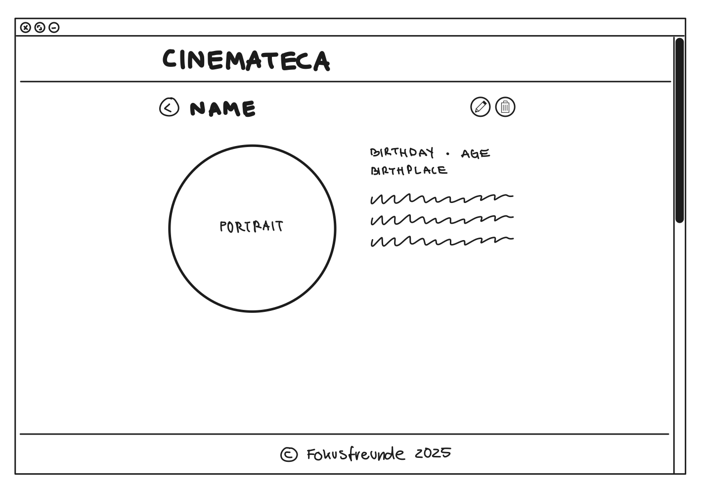

# Cinemateca
Cinemateca is a web application that serves as a comprehensive movie catalog, allowing users to browse and search a vast database of films.

## Members of the Group
* Alejandro Guzmán Sánchez (E-Mail: a.guzmans.2025@urjc.es, GitHub: [AlejandroGS47](https://github.com/AlejandroGS47)
* Farina Schlegel (E-Mail: f.schlegel.2025@alumnos.urjc.es, GitHub: [frinnana](https://github.com/frinnana))
* Felix Schwabe (E-Mail: f.schwabe.2025@alumnos.urjc.es, GitHub: [7dns](https://github.com/7dns))

## Links
[Link to Trello](https://trello.com/invite/b/68d0f24f8deb98189ef954eb/ATTI17034f224bc8ee2a098984e95cb7a264E5C95465/cinemateca)

## Functionality
### Entites

#### Movies
Movies are the central entities of the web application. Each movie contains essential information and is connected to the people involved in its production. One Movie can have one or more Persons.

A Movie has: 
* unique ID,
* title, 
* poster (image file), 
* short description, 
* genre, 
* release year,
* country of production, 
* age rating,
* one or more persons

#### Person
The secondary entity in the application is Person. A person represents an individual involved in one or more movies, such as an actor, director or writer. Every person must be linked to at least one movie.

A Person has:
* unique ID, 
* first name,
* last name,
* portrait  (image file),
* date of birth, 
* short description, 
* one or more movies (role/function)

### Search
The application will include a search function that allows users to find movies by their title or by the name of a person (e.g. actor, director or writer) involved in the movie.

### Filtering
The application will include a function to filter search results (e.g. by genre, release year or country of production).

## Wireframes
The following wireframes show the planned layout of Cinemateca, giving a visual overview of the application’s structure and functionality.

### Wide Screen Views

### Mobile Views

